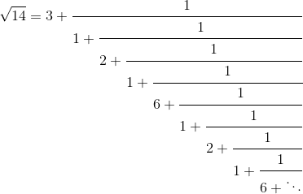
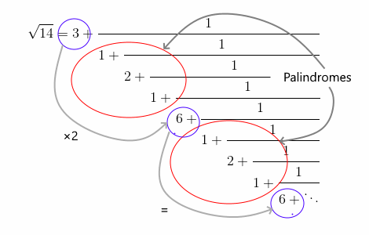

# [Квадратные корни с нечетным периодом](TODO)
## [Проблема](https://euler.jakumo.org/problems/view/64.html)

> Любой квадратный корень является периодическим, если записать его в виде непрерывных дробей в следующей форме:
> 
> <table border="0" cellspacing="0" cellpadding="0">
> <tbody><tr>
> <td>√<var>N</var> = <var>a</var><sub>0</sub> +</td>
> <td colspan="3" style="border-bottom:1px solid #000;">
> <div style="text-align:center;">1</div>
> </td>
> </tr>
> <tr>
> <td>&nbsp;</td>
> <td><var>a</var><sub>1</sub> +</td>
> <td colspan="2" style="border-bottom:1px solid #000;">
> <div style="text-align:center;">1</div>
> </td>
> </tr>
> <tr>
> <td>&nbsp;</td>
> <td>&nbsp;</td>
> <td><var>a</var><sub>2</sub> +</td>
> <td style="border-bottom:1px solid #000;">
> <div style="text-align:center;">1</div>
> </td>
> </tr>
> <tr>
> <td>&nbsp;</td>
> <td>&nbsp;</td>
> <td>&nbsp;</td>
> <td><var>a</var><sub>3</sub> + …</td>
> </tr>
> </tbody></table>
>
> К примеру, рассмотрим √23:
> 
> <table border="0" cellspacing="0" cellpadding="0">
> <tbody><tr>
> <td>√23 = 4 + √23 — 4 = 4 +&nbsp;</td>
> <td style="border-bottom:1px solid #000;">
> <div style="text-align:center;">1</div>
> </td>
> <td>&nbsp;= 4 +&nbsp;</td>
> <td colspan="2" style="border-bottom:1px solid #000;">
> <div style="text-align:center;">1</div>
> </td>
> </tr>
> <tr>
> <td>&nbsp;</td>
> <td>
> <div style="text-align:center;">1<br><span style="border-top:1px solid #000;">√23—4</span></div>
> </td>
> <td>&nbsp;</td>
> <td>1 +&nbsp;</td>
> <td>
> <div style="text-align:center;"><span style="border-bottom:1px solid #000;">√23 – 3</span><br>7</div>
> </td>
> </tr>
> </tbody></table>
> 
> 
> Продолжив это преобразование, мы получим следующее приближение:
> 
> <table border="0" cellspacing="0" cellpadding="0">
> <tbody><tr>
> <td>√23 = 4 +</td>
> <td colspan="4" style="border-bottom:1px solid #000;">
> <div style="text-align:center;">1</div>
> </td>
> </tr>
> <tr>
> <td>&nbsp;</td>
> <td>1 +</td>
> <td colspan="3" style="border-bottom:1px solid #000;">
> <div style="text-align:center;">1</div>
> </td>
> </tr>
> <tr>
> <td>&nbsp;</td>
> <td>&nbsp;</td>
> <td>3 +</td>
> <td colspan="2" style="border-bottom:1px solid #000;">
> <div style="text-align:center;">1</div>
> </td>
> </tr>
> <tr>
> <td>&nbsp;</td>
> <td>&nbsp;</td>
> <td>&nbsp;</td>
> <td>1 +</td>
> <td style="border-bottom:1px solid #000;">
> <div style="text-align:center;">1</div>
> </td>
> </tr>
> <tr>
> <td>&nbsp;</td>
> <td>&nbsp;</td>
> <td>&nbsp;</td>
> <td>&nbsp;</td>
> <td>8 + …</td>
> </tr>
> </tbody></table>
> 
> Этот процесс можно обобщить в следующем виде:
> 
> <table border="0" cellspacing="0" cellpadding="0">
> <tbody><tr>
> <td><var>a</var><sub>0</sub> = 4,</td>
> <td>&nbsp;</td>
> <td>
> <div style="text-align:center;">1<br><span style="border-top:1px solid #000;">√23—4</span></div>
> </td>
> <td>&nbsp;=&nbsp;</td>
> <td>
> <div style="text-align:center;"><span style="border-bottom:1px solid #000;">√23+4</span><br>7</div>
> </td>
> <td>&nbsp;=&nbsp;1 +&nbsp;</td>
> <td>
> <div style="text-align:center;"><span style="border-bottom:1px solid #000;">√23—3</span><br>7</div>
> </td>
> </tr>
> <tr>
> <td><var>a</var><sub>1</sub> = 1,</td>
> <td>&nbsp;</td>
> <td>
> <div style="text-align:center;">7<br><span style="border-top:1px solid #000;">√23—3</span></div>
> </td>
> <td>&nbsp;=&nbsp;</td>
> <td>
> <div style="text-align:center;"><span style="border-bottom:1px solid #000;">7(√23+3)</span><br>14</div>
> </td>
> <td>&nbsp;=&nbsp;3 +&nbsp;</td>
> <td>
> <div style="text-align:center;"><span style="border-bottom:1px solid #000;">√23—3</span><br>2</div>
> </td>
> </tr>
> <tr>
> <td><var>a</var><sub>2</sub> = 3,</td>
> <td>&nbsp;</td>
> <td>
> <div style="text-align:center;">2<br><span style="border-top:1px solid #000;">√23—3</span></div>
> </td>
> <td>&nbsp;=&nbsp;</td>
> <td>
> <div style="text-align:center;"><span style="border-bottom:1px solid #000;">2(√23+3)</span><br>14</div>
> </td>
> <td>&nbsp;=&nbsp;1 +&nbsp;</td>
> <td>
> <div style="text-align:center;"><span style="border-bottom:1px solid #000;">√23—4</span><br>7</div>
> </td>
> </tr>
> <tr>
> <td><var>a</var><sub>3</sub> = 1,</td>
> <td>&nbsp;</td>
> <td>
> <div style="text-align:center;">7<br><span style="border-top:1px solid #000;">√23—4</span></div>
> </td>
> <td>&nbsp;=&nbsp;</td>
> <td>
> <div style="text-align:center;"><span style="border-bottom:1px solid #000;">7(√23+4)</span><br>7</div>
> </td>
> <td>&nbsp;=&nbsp;8 +&nbsp;</td>
> <td>√23—4</td>
> </tr>
> <tr>
> <td><var>a</var><sub>4</sub> = 8,</td>
> <td>&nbsp;</td>
> <td>
> <div style="text-align:center;">1<br><span style="border-top:1px solid #000;">√23—4</span></div>
> </td>
> <td>&nbsp;=&nbsp;</td>
> <td>
> <div style="text-align:center;"><span style="border-bottom:1px solid #000;">√23+4</span><br>7</div>
> </td>
> <td>&nbsp;=&nbsp;1 +&nbsp;</td>
> <td>
> <div style="text-align:center;"><span style="border-bottom:1px solid #000;">√23—3</span><br>7</div>
> </td>
> </tr>
> <tr>
> <td><var>a</var><sub>5</sub> = 1,</td>
> <td>&nbsp;</td>
> <td>
> <div style="text-align:center;">7<br><span style="border-top:1px solid #000;">√23—3</span></div>
> </td>
> <td>&nbsp;=&nbsp;</td>
> <td>
> <div style="text-align:center;"><span style="border-bottom:1px solid #000;">7(√23+3)</span><br>14</div>
> </td>
> <td>&nbsp;=&nbsp;3 +&nbsp;</td>
> <td>
> <div style="text-align:center;"><span style="border-bottom:1px solid #000;">√23—3</span><br>2</div>
> </td>
> </tr>
> <tr>
> <td><var>a</var><sub>6</sub> = 3,</td>
> <td>&nbsp;</td>
> <td>
> <div style="text-align:center;">2<br><span style="border-top:1px solid #000;">√23—3</span></div>
> </td>
> <td>&nbsp;=&nbsp;</td>
> <td>
> <div style="text-align:center;"><span style="border-bottom:1px solid #000;">2(√23+3)</span><br>14</div>
> </td>
> <td>&nbsp;=&nbsp;1 +&nbsp;</td>
> <td>
> <div style="text-align:center;"><span style="border-bottom:1px solid #000;">√23—4</span><br>7</div>
> </td>
> </tr>
> <tr>
> <td><var>a</var><sub>7</sub> = 1,</td>
> <td>&nbsp;</td>
> <td>
> <div style="text-align:center;">7<br><span style="border-top:1px solid #000;">√23—4</span></div>
> </td>
> <td>&nbsp;=&nbsp;</td>
> <td>
> <div style="text-align:center;"><span style="border-bottom:1px solid #000;">7(√23+4)</span><br>7</div>
> </td>
> <td>&nbsp;=&nbsp;8 +&nbsp;</td>
> <td>√23—4</td>
> </tr>
> </tbody></table>
> 
> 
> Нетрудно заметить, что последовательность является периодической. Для краткости введем обозначение √23 = [4;(1,3,1,8)], чтобы показать что блок (1,3,1,8) бесконечно повторяется.
> 
> Первые десять представлений непрерывных дробей (иррациональных) квадратных корней:
> 
>     √2 = [1;(2)], период = 1
>     √3 = [1;(1,2)], период = 2
>     √5 = [2;(4)], период = 1
>     √6 = [2;(2,4)], период = 2
>     √7 = [2;(1,1,1,4)], период = 4
>     √8 = [2;(1,4)], период = 2
>     √10 = [3;(6)], период = 1
>     √11 = [3;(3,6)], период = 2
>     √12 =  [3;(2,6)], период = 2
>     √13 = [3;(1,1,1,1,6)], период = 5
> 
> Период является нечетным у ровно четырех непрерывных дробей при N ≤ 13.
> 
> У скольких непрерывных дробей период является нечетным при N ≤ 10000?

``` python
solution() =>  1322 
```

## Частное решение (1)

Давайте посмотрим на представление непрерывной дроби для √14.



Несложно заметить что, последовательность знаменателей повторяется:

`3`, 1, 2, 1, `6`, 1, 2, 1, `6`, 1, 2, 1, `6`, …

Для любого целого числа d, которое не является квадратным, непрерывная дробь √d имеет шаблон.
1. Коэффициенты после ведущего первого коэффициента являются периодическими.
2. Цикл состоит из палиндрома, за которым следует одно число.
3. Последнее число в цикле в два раза превышает ведущий коэффициент.

**Примечание:** ведущим коэффициентом является целая часть квадратного корня из d, т. Е. ⌊√d⌋, причём последний коэффициент в каждом периоде равен 2⌊√d⌋.

В приведенном выше примере периодической частью является {1, 2, 1, 6}.
Палиндром равен {1, 2, 1}, а 6 в два раза превышает начальный коэффициент 3.




```python
class ContinuedFraction(namedtuple('ContinuedFraction', 'integer coefficients base')):
    __slots__ = ()

    def __str__(self):
        period = "({})".format(", ".join(map(str, self.coefficients)))
        return f"√{self.base} = ⟨{self.integer}; {period}⟩"


def find_continuted_fraction(number) -> ContinuedFraction:
    """
    Решение основано на:
            https://en.wikipedia.org/wiki/Methods_of_computing_square_roots#Continued_fraction_expansion

    >>> print(find_continuted_fraction(7))
    √7 = ⟨2; (1, 1, 1, 4)
    >>> print(find_continuted_fraction(12))
    √12 = ⟨3; (2, 6)⟩
    >>> print(find_continuted_fraction(13))
    √13 = ⟨3; (1, 1, 1, 1, 6)⟩
    """

    if int(sqrt(number)) == sqrt(number):
        return ContinuedFraction(int(sqrt(number)), (), number)

    numerator = 0
    denominator = 1
    root = int(sqrt(number))
    coefficients = [root]

    while coefficients[-1] != 2 * root:
        numerator = denominator * coefficients[-1] - numerator
        denominator = (number - numerator ** 2) / denominator
        next_coefficient = int((root + numerator) / denominator)
        coefficients.append(next_coefficient)

    return ContinuedFraction(root, coefficients[1:], number)


def solution(LIMIT):
    """
    Находит количество непрерывных дробей, период которых является нечетным.
    """
    result_count = 0

    for n in range(2, LIMIT + 1):
        fraction = find_continuted_fraction(n)
        if len(fraction.coefficients) % 2 != 0:
            result_count += 1
    return result_count
```
```text
  №     Время  Замедление      Аргумент    Результат
---  --------  ------------  ----------  -----------
  1  0.146717  14.672%            10000         1322 (Ответ)
  2  3.93768   379.097%          100000        11486
```