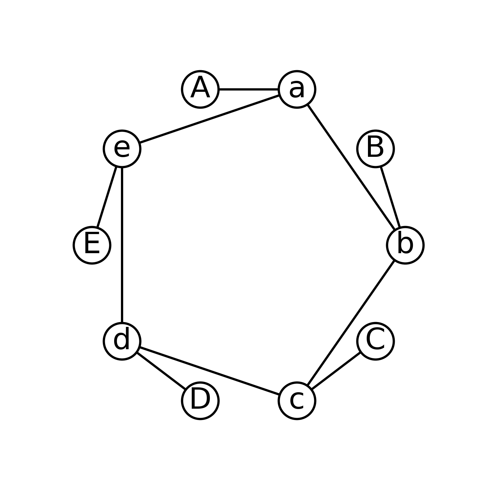
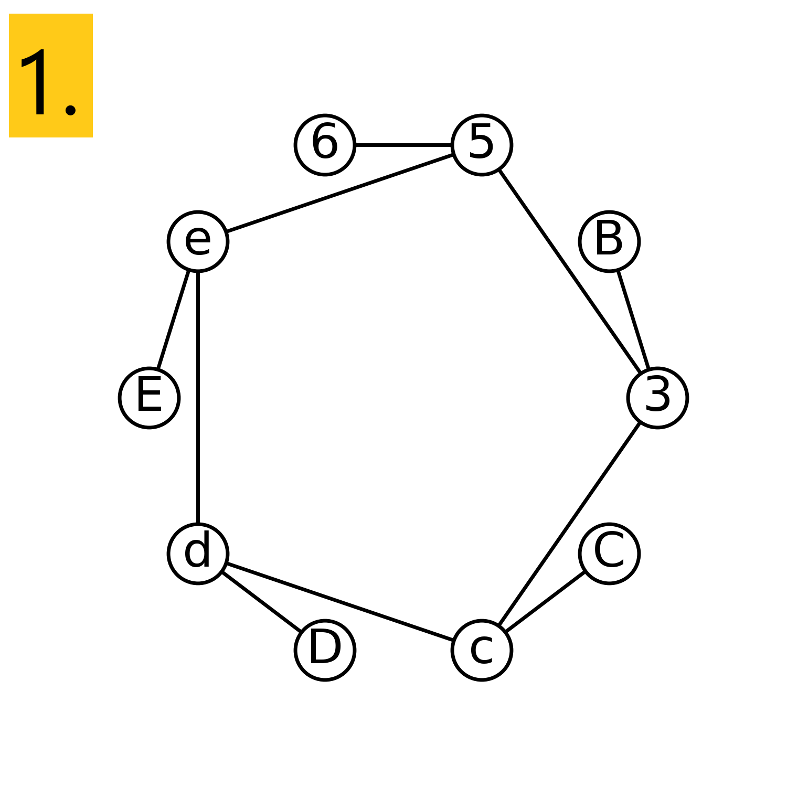
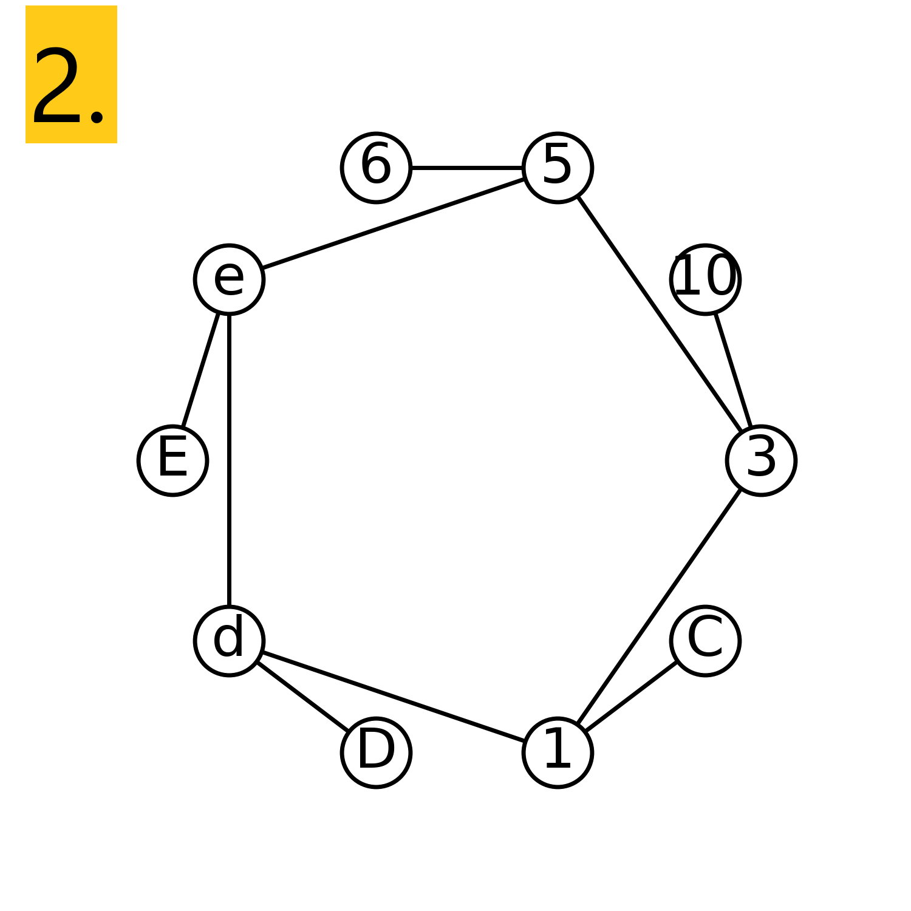
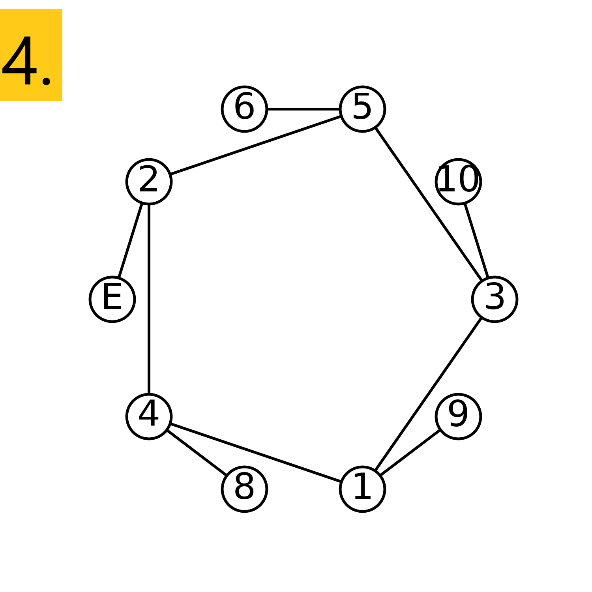
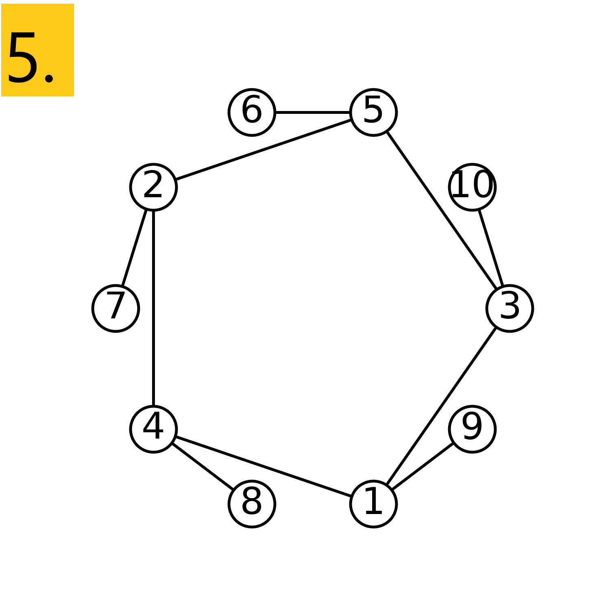

# [Магическое пятиугольное кольцо](TODO)

## [Проблема](https://euler.jakumo.org/problems/view/68.html)

>Рассмотрим следующее "магическое" треугольное кольцо, заполненное числами от 1 до 6, с суммой на каждой линии равной 9.
> 
>
> 
> Проходя по направлению часовой стрелки, начав с группы с наименьшим внешним узлом (в данном примере: 4,3,2), каждое решение можно описать единственным образом.
> К примеру, вышеуказанное решение можно описать множеством: 4,3,2; 6,2,1; 5,1,3.
> 
> Существует возможность заполнить кольцо с четырьмя различными суммами на линиях: 9, 10, 11 и 12.
> Всего существует восемь решений.
> <div class="center">	
> <table width="400" cellspacing="0" cellpadding="0"><tr><td width="100"><b>Сумма</b></td><td width="300"><b>Множество решений</b></td>
> </tr><tr><td>9</td><td>4,2,3; 5,3,1; 6,1,2</td>
> </tr><tr><td>9</td><td>4,3,2; 6,2,1; 5,1,3</td>
> </tr><tr><td>10</td><td>2,3,5; 4,5,1; 6,1,3</td>
> </tr><tr><td>10</td><td>2,5,3; 6,3,1; 4,1,5</td>
> </tr><tr><td>11</td><td>1,4,6; 3,6,2; 5,2,4</td>
> </tr><tr><td>11</td><td>1,6,4; 5,4,2; 3,2,6</td>
> </tr><tr><td>12</td><td>1,5,6; 2,6,4; 3,4,5</td>
> </tr><tr><td>12</td><td>1,6,5; 3,5,4; 2,4,6</td>
> </tr></table></div>
> 
> Объединяя элементы каждой группы, можно образовать 9-тизначную строку. 
> Максимальное значение такой строки для треугольного кольца составляет 432621513.
> 
> 
> 
> Используя числа от 1 до 10, в зависимости от расположения, можно образовать 16-тизначные и 17-тизначные строки. Каково максимальное значение 16-тизначной строки для "магического" пятиугольного кольца?

``` python
solution()  # =>  
```

## Нормальное решение (1)



Для любого магического 5-угольного кольца сумма всех 5 линий будет суммой внешних узлов + дважды * сумма внутренних узлов (так как каждый внутренний узел одновременно является частью 2х линий).
<br>Так как для заполнения используется набор чисел 1-10, а решение должно быть длиной 16 цифр, очевидно, что число 10 должно быть одним из внешних узлов. 
<br>Строка решения не может начинаться более чем с 6, получается, что оптимальный стартовый внешний узел равен 6, а остальные внешние узлы равны 7-10 (так как строка решения всегда начинается с минимального внешнего узла).
<br>Внешние узлы: 6, 7, 8, 9, 10.
<br>Внутренние узлы: 5, 4, 3, 2, 1.

Сумма на линиях должна быть одинаковой, найду её:
<br>1) Общая сумма 5-угольного кольца равна
2 * (1 + 2 + 3 + 4+ 5) + 6 + 7 + 8 + 9 + 10 = 70. 
<br>2) Итак, сумма для каждой линии равна 70/5 = 14.

Наше 5-угольное кольцо выглядит так:

Первая линия (6,a,b): 14-6=8; a+b=8 вместо a и b могут быть только 2 числа, 3 и 5. Поскольку надо максимально увеличить строку результата, a=5.
Внешний узел 10 может быть только на линии (B,3,c): 14-10-3=1, c=1.

Внешний узел 9 может быть только на линии (С,1,d): 14-9-1=1, d=4.

Внешний узел 8 может быть только на линии (D,1,e): 14-8-4=2, e=2.

Внешний узел 7 может быть только на линии (E,2,5).

Итак, результат: 6,5,3; 10,3,1; 9,1,4; 8,4,2; 7,2,5;

## Нормальное решение (1)
```python
import itertools


def permutations(list_):
    if len(list_) == 0:
        yield []
    elif len(list_) == 1:
        yield list_
    else:
        for i in range(len(list_)):
            x = list_[i]
            xs = list_[:i] + list_[i + 1:]
            for p in permutations(xs):
                yield [x] + p


class Ring(object):
    def __init__(self, digits):
        self._digits = digits
        self._size = int(len(digits) / 2)
        self._inner_nodes = digits[:self._size]
        self._outer_nodes = digits[self._size:]

    def is_magic(self):
        first_sum = sum(self.get_line(0))
        for i in range(1, self._size):
            if sum(self.get_line(i)) != first_sum:
                return False
        return True

    def get_line(self, number):
        return (
            self._outer_nodes[number],
            self._inner_nodes[number],
            self._inner_nodes[(number + 1) % self._size],
        )

    def construct_string(self):
        result = []
        min_index = self._outer_nodes.index(min(self._outer_nodes))

        for i in range(self._size):
            result.extend(
                map(str, (self._outer_nodes[(min_index + i) % self._size],
                          self._inner_nodes[(min_index + i) % self._size],
                          self._inner_nodes[(min_index + (i + 1)) % self._size]))
            )
        return ''.join(result)

    def visualize(self):
        import networkx as nx
        from matplotlib import pyplot as plt

        ring_graph = []
        for i in range(self._size):
            ring_graph.append([self._inner_nodes[i], self._outer_nodes[i]])
        ring_graph.reverse()
        for i in range(self._size):
            if i != self._size - 1:
                ring_graph.append([self._inner_nodes[i], self._inner_nodes[i + 1]])
            else:
                ring_graph.append([self._inner_nodes[i], self._inner_nodes[0]])
        options = {
            "font_size": 66,
            "node_size": 6600,
            "node_color": "white",
            "edgecolors": "black",
            "linewidths": 5,
            "width": 5,
        }
        G = nx.Graph()
        G.add_edges_from(ring_graph)
        pos = nx.circular_layout(G)
        plt.figure(figsize=(15, 15))
        plt.title(label=f'Result: {self.construct_string()}', fontsize=60)
        nx.draw_networkx(G, pos=pos, **options)
        # Set margins for the axes so that nodes aren't clipped
        ax = plt.gca();
        ax.margins(0.10)
        plt.axis("off")
        plt.show()
        return ring_graph

    def __repr__(self):
        return f'Ring({self._digits})'

    def __str__(self):
        return self.construct_string()


def solution(digits, digits_in_result):
    ring_size = len(digits) // 2
    results = set()

    for permutation in itertools.permutations(digits):
        if permutation[0] != min(permutation[:ring_size]):
            continue
        ring = Ring(permutation)
        if ring.is_magic():
            results.add(ring.construct_string())
    return max(
        filter(lambda s: len(s) == digits_in_result, results)
    )
```
```
>>> solution(list(range(1, 6 + 1)), 9)
Таймер закончил работу, время = 0.0626s
432621513

>>> solution(list(range(1, 10 + 1)), 16)
Таймер закончил работу, время = 2.41s
6531031914842725
```