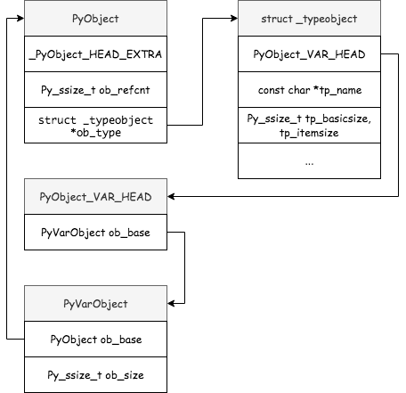
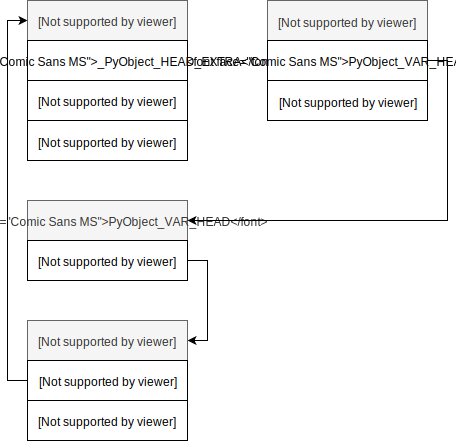
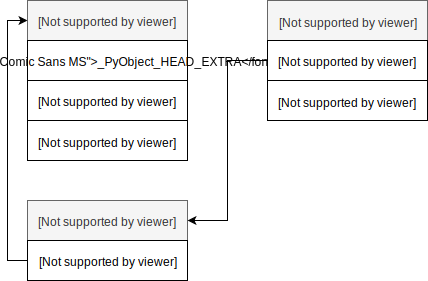
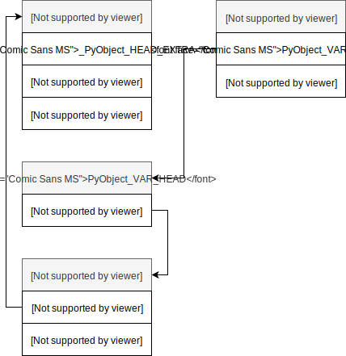

# <center>Неизменяемые типы данных</center>

* [PyObject](#Все-является-объектом)
* [PyLongObject](#Длинная-арифметика-в-Python)
  - [algorithm: split int](#Преобразования-длинного-целого-в-массив)
  - [small ints](#Оптимизации)
  - [algorithm: add bignum](#Выполнение-арифметических-операций)
* [PyFloatObject](#Числа-с-плавающей-точкой-и-стандарт-IEEE-754)
* [PyBoolObject](#Булевый-тип)
* [PyASCIIObject](#Строки)
    - [kind](#Строки)
    - [interned](#Интернирование-строк)
* [PyTupleObject](#Кортежи)

Типы данных можно разделить на изменяемые (mutable), то есть, значение которых можно изменить после создания, и неизменяемые (immutable), соответственно, значение которых нельзя изменить после создания.

## Все является объектом
В Python все является объектом («Everything is an Object»): числа, последовательности, функции, классы, модули и т.д.
Каждый объект обладает уникальным идентификатором, который никогда не изменяется после создания объекта (в CPython идентификатором объекта является его адрес в памяти, который можно получить с помощью встроенной функции `id()`), типом, который определяет «чем является объект» (числом, строкой, списком и т.д.) и какие действия над ним можно выполнять, а также значением.

Каждый объект «наследуется» от Си-структуры [`PyObject`](https://github.com/python/cpython/blob/3.8/Include/object.h#L104) или [`PyVarObject`](https://github.com/python/cpython/blob/3.8/Include/object.h#L113).

```c
typedef struct _object {
    _PyObject_HEAD_EXTRA
    Py_ssize_t ob_refcnt;
    struct _typeobject *ob_type;
} PyObject;
```

- `_PyObject_HEAD_EXTRA` - макрос, который определяет два поля `_ob_next` и `_ob_prev` - указатели на следующий и предыдущий объекты, соответственно. Будут ли эти поля включены в структуру PyObject или нет - зависит от флага `Py_TRACE_REFS`, который по умолчанию не установлен;
- `ob_refcnt` - счетчик ссылок на объект, который увеличивается или уменьшается, при копировании или удалении указателя на объект; когда счетчик ссылок достигает нуля, то объект удаляется. 
- `ob_type` - указатель на структуру [`_typeobject`](https://docs.python.org/3/c-api/typeobj.html), которая задает тип объекта.

Структура `PyVarObject` включает одно дополнительное поле `ob_size` - количество элементов в объекте (например, для списка из пяти элементов ob_size будет равен 5):

```c
typedef struct {
    PyObject ob_base;
    Py_ssize_t ob_size; /* Number of items in variable part */
} PyVarObject;
```

Cвязи между соответствующими структурами показаны на следующем рисунке:




**Итак**, если вы решили ввести свой тип, то он должен «наследоваться» от `PyObject` или `PyVarObject` с помощью макросов `PyObject_HEAD` и `PyObject_VAR_HEAD`:
```c
typedef struct _myobject {
       PyObject_HEAD
       ...
} PyMyObject;
```
Таким образом, `PyMyObject` будет содержать все поля, которые есть в `PyObject`.

Итак, `PyObject` и `PyVarObject` являются наиболее общими структурами для представления объектов в CPython.

---
## Целочисленный тип данных и числа с плавающей точкой
Без использования стандартной библиотеки языка нам доступны целые числа (`int`), вещественные числа (`float`) и комплексные числа (`complex`):

```python
>>> year = 2021
>>> year - 1
2020
```

> <p style='font-size:20px;color:lawngreen;'> 📝Примечание:</p>
>
> Процесс создания новой переменной называется name binding, то есть, связывание имени с некоторым объектом, в данном случае именем выступает year, а объектом целое число 2021.


Для записи очень больших или очень маленьких чисел удобно использовать экспоненциальную форму записи чисел.
```python
>>> 2.021 * 10**3
2021.0
>>> 2.021E3
2021.0
```

Не стоит забывать про [ошибки округления](https://floating-point-gui.de/errors/rounding/) при работе с вещественными числами:

```python
>>> 0.1 + 0.1 + 0.1 + 0.1 + 0.1 + 0.1 + 0.1 + 0.1 + 0.1 + 0.1
0.9999999999999999
```

### Длинная арифметика в Python
Может ли произойти переполнение при работе с целыми числами в Python? Нет, если мы **не** говорим о таких пакетах как Numpy и Pandas, так как при работе с целыми числами в Python используется [длинная арифметика](https://ru.wikipedia.org/wiki/Длинная_арифметика).

Структура [`PyLongObject`](https://github.com/python/cpython/blob/3.8/Include/longintrepr.h#L85) отвечает за представление целых чисел:

```c
struct _longobject {
    PyObject_VAR_HEAD
    digit ob_digit[1];
} PyLongObject;
```

Если «раскрыть» макрос `PyObject_VAR_HEAD`, то структура будет выглядеть следующим образом:

```c
struct _longobject {
    ssize_t ob_refcnt;
    struct _typeobject *ob_type;
    ssize_t ob_size; 
    uint32_t ob_digit[1];
} PyLongObject;
```



> <p style='font-size:20px;color:lawngreen;'> 📝Примечание:</p>
>
> Можно заметить, что `PyLongObject` «наследуется» от `PyVarObject`, то есть является объектом переменной длины, и, таким образом, включает поле `ob_size`, которое в данном случае содержит размер массива `ob_digit`.

`PyLongObject` добавляет лишь одно новое поле `ob_digit` - массив беззнаковых целых чисел по основанию
2<sup>30</sup>. 


### Представление произвольно больших целых чисел
Как хранить произвольно большое целое число? Одним из решений является представление целого числа в виде массива отдельных цифр. 
Для наиболее эффективного использования памяти мы можем конвертировать наше число из десятичной системы счисления в систему счисления по основанию 2<sup>30</sup>, в таком случае каждый элемент представлен «цифрой» в диапазоне от 0 до 2<sup>30</sup>-1.
В зависимости от платформы Python использует или 32-битные беззнаковые массивы с 30-битными цифрами или 16-битные беззнаковые массивы с 15-битными цифрами. 
Такой подход представления больших целых чисел связан с [дополнительными ограничениями](https://github.com/python/cpython/blob/865e4b4f630e2ae91e61239258abb58b488f1d65/Include/longintrepr.h#L9), которые и не позволяют использовать все биты.
Поле `ob_digit` структуры показанной выше, содержит такие массивы цифр.

Для избежания лишних вычислений в CPython есть эффективный способ представления целых чисел в диапазоне от -2<sup>30</sup> до 2<sup>30</sup>.
Такие целые числа хранятся как массивы с одним элементом, то есть, состоящие из одной цифры

Также следует отметить, что в отличие от классического представления знака числа (т.е. использования знакового бита), знак целого числа хранится в поле `ob_size`, которое также содержит размер массива `ob_digit`.
Например, если мы хотим изменить знак целого с размером `ob_size`=2 (две цифры), то `ob_size` станет равным -2.

Комментарий из исходных текстов по представлению целых чисел:
```c
/* Long integer representation.
   The absolute value of a number is equal to
   SUM(for i=0 through abs(ob_size)-1) ob_digit[i] * 2**(SHIFT*i)
   Negative numbers are represented with ob_size < 0;
   zero is represented by ob_size == 0.
   In a normalized number, ob_digit[abs(ob_size)-1] (the most significant
   digit) is never zero.  Also, in all cases, for all valid i,
   0 <= ob_digit[i] <= MASK.
   The allocation function takes care of allocating extra memory
   so that ob_digit[0] ... ob_digit[abs(ob_size)-1] are actually available.

   CAUTION:  Generic code manipulating subtypes of PyVarObject has to aware that integers abuse  ob_size's sign bit.
*/
```

Давайте рассмотрим конкретный пример преобразования длинного целого в массив и обратно. Пусть у нас имеется следующее число:
**123456789101112131415**. Переведем его в систему счисления по основанию 2<sup>30</sup>, путем последовательного деления и записи остатка от деления:


Конвертировать число обратно также достаточно просто:

(437976919 ∗ 2<sup>30 ∗ 0</sup>) + (87719511 ∗ 2<sup>30 ∗ 1</sup>) + (107 ∗ 2<sup>30 ∗ 2</sup>) = **123456789101112131415**

### Преобразования длинного целого в массив

Упрощенный вариант алгоритма представления произвольно больших чисел:


```python
SHIFT = 30  # Число бит под каждую «цифру»
MASK = (2 ** SHIFT)

def split_number(bignum):
    t = abs(bignum)

    num_list = []
    while t != 0:
        # Взятие остатка от деления
        small_int = t % MASK  # Побитовый аналог: (t & (MASK-1))
        num_list.append(small_int)

        # Взятие целой части от деления
        t = t // MASK  # Побитовый аналог: t >>= SHIFT

    return num_list

def restore_number(num_list):
    bignum = 0
    for i, n in enumerate(num_list):
        bignum += n * (2 ** (SHIFT * i))
    return bignum
```
```python
>>> bignum = 123456789101112131415
>>> num_list = split_number(bignum)
>>> num_list
[437976919, 87719511, 107]
>>> bignum == restore_number(num_list)
True
```

Чтобы убедиться, что нигде не ошиблись, то можно посмотреть на внутреннее представление целого числа с помощью модуля [ctypes](https://docs.python.org/3/library/ctypes.html), который позволяет взаимодействовать с Си-кодом из Python:

```python
import ctypes

class PyLongObject(ctypes.Structure):
    _fields_ = [("ob_refcnt", ctypes.c_ssize_t),
                ("ob_type", ctypes.c_void_p),
                ("ob_size", ctypes.c_ssize_t),
                ("ob_digit", ctypes.c_uint * 3)]
```
```python
>>> bignum = 123456789101112131415
>>> for i,d in enumerate(PyLongObject.from_address(id(bignum)).ob_digit):
...    print(f"ob_digit[{i}] = {d}")
ob_digit[0] = 437976919
ob_digit[1] = 87719511
ob_digit[2] = 107
>>> print("ob_size:", PyLongObject.from_address(id(bignum)).ob_size)
ob_size: 3
```

### Оптимизации
Небольшие целые числа в диапазоне от -5 до 256 преаллоцируются в процессе инициализации интерпретатора. Так как целые числа являются неизменяемыми, то мы можем воспринимать их как синглтоны. Каждый раз, когда нам необходимо создать небольшое целое число (например, как результат некоторой арифметической операции), то вместо создания нового объекта, Python просто возвращает указатель на уже преаллоцированный объект. Это позволяет сократить количество потребляемой памяти и время затрачиваемое на вычисления при работе с небольшими целыми числами.

Давайте рассмотрим простой пример:

```python
>>> a, b = 2, 2
>>> id(a) == id(b)
True
>>> a, b = 257, 257
>>> id(a) == id(b)
False
```
Следует иметь ввиду, что структура PyLongObject занимает не менее 28 байт для каждого целого числа, то есть в три раза больше чем требуется под 64-битное целое в языке C.

```python
>>> import sys
>>> sys.getsizeof(1)
28
```
Из чего складывается такой размер? Указатель на структуру _`typeobject` занимает восемь байт, также по восемь байт занимают поля `ob_refcnt` и `ob_size`, что уже в сумме дает нам 24 байта. 
Каждый элемент массива `ob_digit` это еще четыре байта. 
Итого для небольших целых чисел требуется 28 байт. Но есть одно исключение - ноль:
```python
>>> import sys
>>> sys.getsizeof(0)
24
```

### Выполнение арифметических операций
Базовые арифметические операции выполняются аналогично тому, как мы это делали когда-то в школе, с одним исключением: каждый элемент массива считается «цифрой».

Давайте рассмотрим вариант алгоритма сложения с переносом:

```python
def add_bignum(a, b):
    z = []

    if len(a) < len(b):
        a, b = b, a

    carry = 0

    for i in range(0, len(b)):
        carry += a[i] + b[i]
        z.append(carry % MASK)
        carry = carry // MASK

    for i in range(i + 1, len(a)):
        carry += a[i]
        z.append(carry % MASK)
        carry = carry // MASK

    z.append(carry)

    # Удалим завершающие нули
    i = len(z)
    while i > 0 and z[i-1] == 0:
        i -= 1
    z = z[0:i]

    return z
```
```python
>>> a = 8223372036854775807
>>> b = 100037203685477
>>> restore_number(add_bignum(split_number(a), split_number(b))) == a + b
True
```

### <spam style='font-size:20px;color:lawngreen;'> Замечание</spam> про Numpy и Pandas
В тех случаях, когда мы пользуемся библиотеками numpy/scipy/pandas и т.д., может произойти переполнение при работе с целыми числами, так как структуры, лежащие в основе этих библиотек, для более эффективного использования памяти, полагаются на соответствующие С-типы ограниченной точности:

```python
>>> import numpy as np
>>> ar = np.array([2**63 - 1, 2**63 - 1])
>>> ar
array([9223372036854775807, 9223372036854775807])
>>> ar.dtype
dtype('int64')
```

Элементами `ndarray` являются 64-битные знаковые целые, таким образом, 2<sup>63</sup>−1 наибольшее положительное значение, которое мы можем хранить в `ndarray`.
Добавление 1 приведет к переполнению:

```python
>>> ar + 1
array([-9223372036854775808, -9223372036854775808])
>>> np.sum(ar)
-2
```

## Числа с плавающей точкой и стандарт IEEE-754
Вещественные числа в CPython представлены структурой PyFloatObject:

```c
typedef struct {
    PyObject_HEAD
    double ob_fval;
} PyFloatObject;
```



Легко заметить, что поле `ob_fval` это обычное вещественное число двойной точности. 
Все арифметические операции над вещественными числами в Python являются простыми обертками над соответствующими арифметическими операциями в Си, например, операция сложения определена следующим образом:

```c 
static PyObject *
float_add(PyObject *v, PyObject *w)
{
    double a,b;
    CONVERT_TO_DOUBLE(v, a);
    CONVERT_TO_DOUBLE(w, b);
    PyFPE_START_PROTECT("add", return 0)
    a = a + b;
    PyFPE_END_PROTECT(a)
    return PyFloat_FromDouble(a);
}
```

Следует помнить, что все вычисления в вещественных числах делаются компьютером с некоторой ограниченной точностью (стандарт IEEE-754), поэтому зачастую вместо «честных» ответов получаются приближенные (к этому надо быть готовым), например:

```python
>>> 0.1 + 0.1 + 0.1 + 0.1 + 0.1 + 0.1 + 0.1 + 0.1 + 0.1 + 0.1
0.9999999999999999
```

Если вы не понимаете, почему не получается единица, то попробуйте перевести число 0.1 в двоичную систему счисления:


Решается это так:
```python
>>> from math import fsum
>>> fsum([0.1, 0.1, 0.1, 0.1, 0.1, 0.1, 0.1, 0.1, 0.1, 0.1])
1.0
```

----
## Булевый тип

Ссылка на исходники: [/Include/boolobject.h](https://github.com/python/cpython/blob/3.8/Include/boolobject.h)
```python
>>> 1 == 2
False
>>> isinstance(True, bool) and isinstance(True, int)
True
```

---
## Строки
Строки в Python представляют собой последовательность символов Юникод (code point'ов).

Для внутреннего представления строк в Python, используются кодировки Latin-1 (1 байт на символ), UCS-2 (2 байта на символ) и UCS-4 (4 байта на символ).
Упрощенно процесс определения кодировки следующий: когда необходимо создать строковый объект (тексты программ обычно в кодировке UTF-8), Python находит самый старший кодовый знак (code point) в строке и выбирает кодировку, в которой кодовый знак может быть представлен «как есть».

Строки представлены не одной структурой, а «иерархией» из трех структур, не считая `PyObject`.
Рассмотрим одну структуру - `PyASCIIObject`, которая содержит большую часть информации о строке, например, какая кодировка используется для хранения строки, длину строки (число кодовых знаков), состоит ли строка только из ASCII-символов, интернирована строка или нет и т.д.

Опишем структуру [PyASCIIObject](https://github.com/python/cpython/blob/8f943ca25732d548cf9f0b0393ba8d582fb93e29/Include/cpython/unicodeobject.h#L81):

```c
import ctypes

class PyASCIIObject(ctypes.Structure):
    _fields_ = [("ob_refcnt", ctypes.c_ssize_t),
                ("ob_type", ctypes.py_object),
                ("length", ctypes.c_ssize_t),
                ("hash", ctypes.c_ssize_t),
                ("interned", ctypes.c_uint, 2),
                ("kind", ctypes.c_uint, 3),
                ("compact", ctypes.c_uint, 1),
                ("ascii", ctypes.c_uint, 1),
                ("ready", ctypes.c_uint, 1),
                ('wstr', ctypes.c_wchar_p)]

def get_string_kind(string):
    return PyASCIIObject.from_address(id(string)).kind
```

Создадим несколько строковых объектов:

```python
>>> greet = 'Hello, world'
>>> greet
'Hello, world'
>>> len(greet)
12
>>> sys.getsizeof(greet)
61 
>>> get_string_kind(greet)
1 # PyUnicode_1BYTE_KIND

>>> greet = 'Hello, 世界'
>>> greet
'Hello, 世界'
>>> len(greet)
9
>>> sys.getsizeof(greet)
92
>>> get_string_kind(greet)
2 # PyUnicode_2BYTE_KIND

>>> greet = 'Hello, \U0001F30D'
>>> greet
'Hello, 🌍'
>>> len(greet)
8
>>> sys.getsizeof(greet)
108
>>> get_string_kind(greet)
4 # PyUnicode_4BYTE_KIND
```

<spam style='font-size:20px;color:red;'>Обратите внимание</spam>, что хотя длина строк и становится меньше, но занимаемый размер наоборот растет, так как используются разные кодировки для внутреннего представления. 
Об этом важно помнить, особенно когда вы работаете с большими объемами текстов, так как один символ эмодзи может увеличить занимаемый размер строки в 4 раза.

Почему для внутреннего представления строк не используется UTF-8? Кодировка UTF-8 подразумевает, что может использоваться варьируемое число байт (от одного до четырех) для кодирования одного символа. UTF-8 является оптимальной кодировкой с точки зрения хранения строк (то есть кодировка эффективна по памяти), но при обращении к отдельным элементам строки (при индексировании), необходимо пройтись по всем символам строки пока мы не дойдем до нужного символа. При фиксированном размере такой проблемы не возникает, для перехода к нужной позиции символа достаточно индекс умножить на размер кодового знака (1, 2 или 4 в зависимости от используемой кодировки).

### Интернирование строк

Для экономии памяти в Python реализовано интернирование строк (string interning). Давайте рассмотрим такой пример, пусть у нас есть два строковых объекта с одинаковым содержимым:

```python
>>> s1 = "hello!"
>>> s2 = "hello!"
>>> s1 is s2
False
```

Хотя содержимое строк совпадает это два разных объекта. С другой стороны:

```python
>>> s1 = "hello"
>>> s2 = "hello"
>>> s1 is s2
True
```
Получается, что адреса в памяти `s1` и `s2` совпадают. Все строки длиной 0 или 1 интернированы, кроме того интернируются все строковые литералы, состоящие из символов латинского алфавита, цифр или нижнего подчеркивания, также интернируются имена переменных, функций, классов и т.д.

Если мы хотим интернировать строку, то следует воспользоваться функцией intern из модуля sys:

```python
>>> import sys
>>> s1 = sys.intern("hello!")
>>> s2 = sys.intern("hello!")
>>> s1 is s2
True
```
Использование интернирования строк гарантирует, что не будет создано двух одинаковых строковых объектов. Когда вы создаете второй объект с тем же значением, что и у существующего объекта, то вы получаете ссылку на уже существующий объект. Таким образом, интернирование строк позволяет экономить память и повышает скорость сравнения строк, путем сравнения их адресов (хешей), а не содержимого.


---
## Кортежи

Последний неизменяемый тип, который мы рассмотрим — это кортежи, которые фактически являются статическими массивами, то есть, имеют фиксированный размер, и представлены структурой [PyTupleObject](https://github.com/python/cpython/blob/3.8/Include/cpython/tupleobject.h#L9):

```c
typedef struct {
    PyObject_VAR_HEAD
    /* ob_item contains space for 'ob_size' elements.
       Items must normally not be NULL, except during construction when
       the tuple is not yet visible outside the function that builds it. */
    PyObject *ob_item[1];
} PyTupleObject;
```


Простой пример создания кортежа из трех элементов:

```python
>>> point = (1.0, 2.0, 3.0)
>>> point
(1.0, 2.0, 3.0)
```


Как уже было отмечено, <spam style='color:indianred;'>важной</spam> особенностью кортежей является то, что это неизменяемая структура:

```python
>>> point[0] = 4
...
TypeError: 'tuple' object does not support item assignment
```

<span style='font-size:20px;color:lawngreen;'> 📝Примечание:</span> Когда мы говорим, что кортежи неизменяемые, то имеем ввиду, что нельзя заменить один элемент кортежа на другой, но сам объект изменить мы можем:

```python

>>> t = (1, [2])
>>> t[1].append(3)
>>> t
(1, [2, 3])
```
