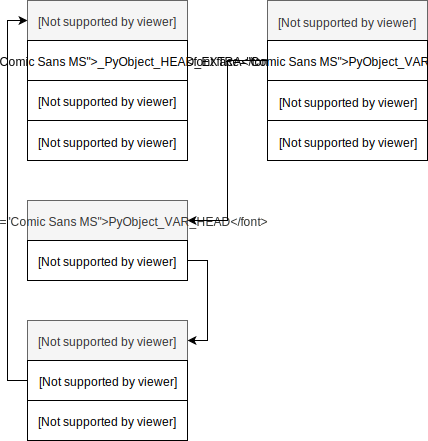
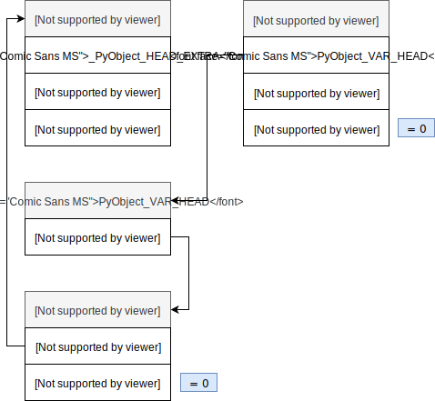
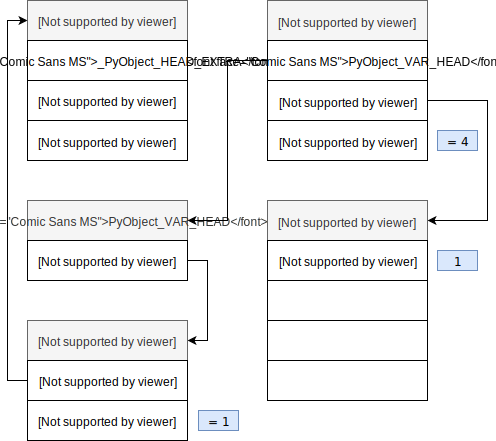
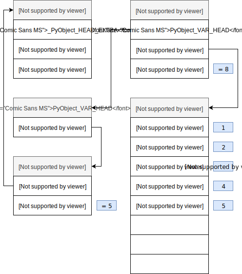
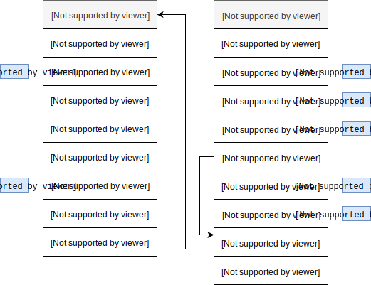
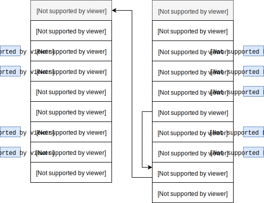
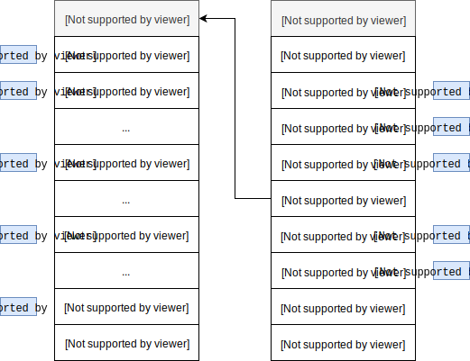

## <center>Изменяемые типы данных</center>

* [PyListObject](#Списки)
* [PyDictObject](#Словари)
    - [memory layout](#Способ-хранения-словаря-в-памяти)
    - [hash collisions](#Механизм-разрешения-коллизий.)
## Списки

Списки как динамические массивы
Списки в Python являются обычными [динамическими массивами](https://en.wikipedia.org/wiki/Dynamic_array) (vector в C++) и обладают всеми их свойствами с точки зрения производительности: в частности, обращение к элементу по его индексу имеет сложность *O(1)*, а поиск элемента имеет сложность *O(N)*.

Списки в CPython определены с помощью следующей структуры [PyListObject](https://github.com/python/cpython/blob/main/Include/listobject.h#L23):

```c 
typedef struct {
    PyObject_VAR_HEAD
    /* Vector of pointers to list elements.  list[0] is ob_item[0], etc. */
    PyObject **ob_item;

    /* ob_item contains space for 'allocated' elements.  The number
     * currently in use is ob_size.
     * Invariants:
     *     0 <= ob_size <= allocated
     *     len(list) == ob_size
     *     ob_item == NULL implies ob_size == allocated == 0
     * list.sort() temporarily sets allocated to -1 to detect mutations.
     *
     * Items must normally not be NULL, except during construction when
     * the list is not yet visible outside the function that builds it.
     */
    Py_ssize_t allocated;
} PyListObject;
```
Где:
  * `ob_item` - массив указателей на `PyObject` (элементы списка);
  * `allocated` - емкость массива (размер буффера), то есть сколько элементов можно поместить в массив `ob_item` до его увеличения, в то время как `ob_size` - текущее количество элементов в массиве.



Если мы добавляем новый элемент в массив и при этом размер массива совпадает с размером буффера, то есть, `ob_size == allocated`, то происходит увеличение размера буффера путем перераспределения памяти по следующему правилу:

```c 
/* This over-allocates proportional to the list size, making room
 * for additional growth.  The over-allocation is mild, but is
 * enough to give linear-time amortized behavior over a long
 * sequence of appends() in the presence of a poorly-performing
 * system realloc().
 * The growth pattern is:  0, 4, 8, 16, 25, 35, 46, 58, 72, 88, ...
 * Note: new_allocated won't overflow because the largest possible value
 *       is PY_SSIZE_T_MAX * (9 / 8) + 6 which always fits in a size_t.
 */
new_allocated = (size_t)newsize + (newsize >> 3) + (newsize < 9 ? 3 : 6);
```
Процесс перераспределения памяти в действии с помощью модуля ctypes:

```python
class ListStruct(ctypes.Structure):
    _fields_ = [("ob_refcnt", ctypes.c_ssize_t),
                ("ob_type", ctypes.c_void_p),
                ("ob_size", ctypes.c_ssize_t),
                ("ob_item", ctypes.c_long),  # PyObject** pointer cast to long
                ("allocated", ctypes.c_ssize_t)]

    def __repr__(self):
        return f"ListStruct(ob_size={self.ob_size}, allocated={self.allocated})"
```
Создадим пустой список:
```python
>>> L = []
>>> ls = ListStruct.from_address(id(L))
>>> ls
ListStruct(ob_size=0, allocated=0)
```


Добавим в список один элемент:
```python
>>> L.append(1)
>>> ls
ListStruct(ob_size=1, allocated=4)
```


Как мы видим и размер и емкость списка изменились в соответствии с правилом роста. Добавим еще несколько элементов в список:
```python
>>> L.extend([2,3,4])
>>> ls
ListStruct(ob_size=4, allocated=4)
>>> L.append(5)
>>> ls
ListStruct(ob_size=5, allocated=8)
```


**Итак**, основные различия между кортежами и списками:

- С точки зрения внутреннего представления кортежи являются статическими массивами, а списки динамическими;
- Кортежи занимают меньше места в памяти, так как имеют фиксированную длину;
- Кортежи неизменяемые (*immutable*) и могут быть выступать в качестве ключей словарей или элементов множеств;
- Кортежи обычно представляют абстрактные объекты, обладающие некоторой структурой (`collections.namedtuple`).


---
## Словари

Словари являются одной из самых важных и сложных структур в Python. Словари представляют собой множество упорядоченных пар вида «ключ:значение».

Иногда словари называют [ассоциативными массивами](https://ru.wikipedia.org/wiki/Ассоциативный_массив), иногда отображениями (имеется ввиду отображение множества ключей словаря в множество его значений).

Как и списки, словари имеют переменную длину, произвольную вложенность и могут хранить значения произвольных типов.

Тем не менее следует знать, что ключами словарей могут быть только хешируемые объекты, то есть те объекты, для которых определена хеш-функция (обычно это числа, строки и кортежи).
Хеш-функция это такая функция, которая задает правило отображания объектов в целые числа.

## Способ хранения словаря в памяти
Рассмотрим сначала то, как выглядит структура отдельно взятого элемента словаря: [pycore_dict.h](https://github.com/python/cpython/blob/main/Include/internal/pycore_dict.h)
```c
typedef struct {
    Py_hash_t me_hash;
    PyObject *me_key;
    PyObject *me_value;
} PyDictKeyEntry;
```
Где:
* `me_hash` – кэшированный хеш-код `me_key`;
* `*me_key` – указатель на объект, содержащий ключ элемента;
* `*me_value` – указатель на объект, содержащий значение элемента;

Словари в CPython определены с помощью следующей структуры: [PyDictObject](https://github.com/python/cpython/blob/064464fc38269e70f7e3a34cb25fc9085ab85782/Include/cpython/dictobject.h#L10) 
```c
typedef struct {
    PyObject_HEAD
    Py_ssize_t ma_used;
    uint64_t ma_version_tag;
    PyDictKeysObject *ma_keys;
    PyObject **ma_values;
} PyDictObject;
```
Выходит, что, при объявлении нового словаря, в памяти создается объект, состоящий из следующих блоков:

* `PyObject_HEAD` – заголовок;
* `Py_ssize_t ma_used` – количество элементов словаря;
* `uint64_t ma_version_tag` – уникальная версия словаря, меняющаяся каждый раз при его обновлении;
* `PyDictKeysObject *ma_keys` – указатель на массив ключей;
* `PyObject **ma_values` – массив указателей на значения ключей. Если `ma_values IS NULL`, то все пары ключ:значение содержатся в `ma_keys`;


Минимальный размер словаря объявлен константой [`PyDict_MINSIZE`](https://github.com/python/cpython/blob/f25f2e2e8c8e48490d22b0cdf67f575608701f6f/Objects/dictobject.c#L104), которая равна 8. Разработчики решили, что это оптимальный размер, для того, чтобы избежать лишнего расходования памяти на хранение пустых значений и времени на динамическое расширение массива. Таким образом при создании словаря (до версии 3.6) вам требовалось минимум 8 элементов в словаре * 24 байт в структуре = 192 байта (это без учёта остальных полей: расходы на саму переменную типа словарь, счётчик числа элементов и т.д.)
Словари используются и для реализации полей пользовательских классов. Python позволяет динамически изменять количество атрибутов, эта динамика не требует дополнительных расходов, так как добавление/удаление атрибута по сути эквивалентно соответствующей операции над словарём. Однако данным функционалом пользуется меньшинство программ, большинство ограничивается полями, объявленными в __init__. Но каждый объект должен хранить свой словарь, со своими ключами и хешами, несмотря на то, что они совпадают с другими объектами. Логичным улучшением тут выглядит хранение общих ключей только в одном месте, именно это и было реализовано в [PEP 412 — Key-Sharing Dictionary](https://www.python.org/dev/peps/pep-0412/). Возможность динамического изменения словаря при этом не исчезла: если меняется порядок или количество ключей словарь преобразуется из разделяющего ключи в обычный.
<br>Во избежание коллизий максимальная «загрузка» словаря составляет 2/3 от текущего размера массива.

```c 
#define USABLE_FRACTION(n) (((n) << 1)/3)
```
Таким образом, первое расширение произойдёт при добавлении 6-го элемента

Массив получается довольно разряжен, во время работы программы от половины до трети ячеек остаются пустыми, что ведёт к увеличенному расходу памяти.
Для того чтобы обойти это ограничение и по возможности хранить только необходимые данные был добавлен новый уровень абстракции массив.

Вместо хранения разряженного массива, например:

```python
d = {'timmy': 'red', 'barry': 'green', 'guido': 'blue'}
``` 
|        Хэш           | Ключ  | Значение |
|:---------------------|:------|:------|
| --                   | --    | --    |
| -8522787127447073495 | barry | green |
| --                   | --    | --    |
| --                   | --    | --    |
| --                   | --    | --    |
| -9092791511155847987 | timmy | red   |
| --                   | --    | --    |
| -6480567542315338377 | guido | blue  |

Начиная с версии 3.6 словари организованны следующим образом:

indices =  [None, 1, None, None, None, 0, None, 2]

|Индекс|        Хэш           | Ключ  | Значение |
|  --- |:---------------------|:------|:------|
|   0  | -8522787127447073495 | barry | green |
|   1  | -9092791511155847987 | timmy | red   |
|   2  | -6480567542315338377 | guido | blue  |

Т.е. хранятся только те записи, которые действительно необходимы, они вынесены из хеш-таблицы в отдельный массив, а в хеш-таблице хранятся только индексы соответствующих записей.
Если изначально на массив уходило 192 байт, то сейчас только 80 (3 * 24-байт для каждой записи + 8 байт на `indices`). 

Размер элемента в `indices` тоже меняется динамически, изначально он равен одному байту, то есть весь массив может быть помещён в один регистр, когда индекс начинает не влезать в 8 бит, то элементы расширяются до 16, потом до 32 бит.

При итерировании по словарю, массив `indices` не нужен, элементы последовательно возвращаются из `entries`, т.к. элементы добавляются каждый раз в конец `entries`, то словарь автоматически сохраняет порядок вхождения элементов.

## Механизм разрешения коллизий.

В python хеш-функции выглядят так:

```python
>>>[hash(i) for i in range(4)]
[-6162929548194046636, 2495159208196040711, -4993025838428375949]
```
Так как при создании словаря от этих хешей берётся остаток от деления, то по сути определяет в какую ячейку пойдёт запись, лишь несколько последних бит ключа (если он целочисленный).
Можно представить себе ситуацию, когда у нас много объектов «хотят» попасть в соседние ячейки, в таком случае при поиске придётся просмотреть множество объектов, которые находятся не на своих местах. 
Для уменьшения числа коллизий и увеличения числа бит, определяющих, в какую ячейку пойдёт запись был реализован следующий механизм:

```c
// вместо простого 
i = i + 1 % n

// было реализовано следующее:
#define PERTURB_SHIFT 5
perturb >>= PERTURB_SHIFT;
j = (5*j) + 1 + perturb;
// использовать значение j % n в качестве следующего индекса
```
Где:
    
* `perturb` — целочисленная переменная, инициализируемая хешем.  
Следует заметить, что в случае большого числа коллизий она обнуляется и следующий индекс вычисляется по формуле:

```c
j = (5 * j + 1) % n
```

При извлечении элемента из словаря осуществляется такой же поиск: 
    вычисляется индекс слота, в котором должен находиться элемент, если слот пуст, то выбрасывается исключение.
    Если же значение в данном слоте есть, необходимо проверить, что его ключ соответствует искомому, это вполне может не выполняться, если произошла коллизия.

><span style='font-size:20px;color:lawngreen;'> 📝Примечание:</span>
> 
> Ключом может быть почти любой объект, в том числе такой, для которого, операция сравнения занимает значительное время.
>
>Дабы избежать длительной операции сравнения, в Python применено несколько трюков:
>
>```python
>def eq(key, entity):
>    if id(key) == id(entity): return True
>    if hash(key) != hash(entity): return False
>    return key == entity 
>```
>Сначала сравниваются указатели, если указатель ключа искомого объекта равен указателю объекта, по которому осуществляется поиск, то есть указывают на одну и ту же область памяти, то сравнение сразу же возвращает истинно.
><br> Но и это не всё. Как известно, у равных объектов должны быть равные хеши, из чего следует, что объекты с разными хешами не равны. И лишь, если хеши равны, будет вызвано обычное сравнение.

---
## Множества

Последний изменяемый тип, который мы рассмотрим, это множества.
Простыми словами, множество – это неупорядоченная коллекция уникальных элементов.

><span style='font-size:20px;color:lawngreen;'> 📝Примечание:</span>
>
>Будучи неупорядоченной коллекцией, множества не записывают положение элементов или порядок вставки.
> <br> Соответственно, наборы не поддерживают индексирование, срезы или другое поведение, подобное последовательности.

Множества представлены структурой [`PySetObject`](https://github.com/python/cpython/blob/bb3e0c240bc60fe08d332ff5955d54197f79751c/Include/setobject.h#L42), а элементами множества являются записи, представленные структурой [`setentry`](https://github.com/python/cpython/blob/bb3e0c240bc60fe08d332ff5955d54197f79751c/Include/setobject.h#L26):


```c 
typedef struct {
    PyObject *key;
    Py_hash_t hash;             /* Cached hash code of the key */
} setentry;

typedef struct {
    PyObject_HEAD

    Py_ssize_t fill;            /* Number active and dummy entries*/
    Py_ssize_t used;            /* Number active entries */
    Py_ssize_t mask;
    setentry *table;
    Py_hash_t hash;             /* Only used by frozenset objects */
    Py_ssize_t finger;          /* Search finger for pop() */

    setentry smalltable[PySet_MINSIZE];
    PyObject *weakreflist;      /* List of weak references */
} PySetObject;
```


Создадим пустое множество: [setobject.c/make_new_set](https://github.com/python/cpython/blob/3.8/Objects/setobject.c#L1025)

```python
>>> s = set()
```


Добавим в него несколько элементов: [setobject.c/set_add_entry](https://github.com/python/cpython/blob/3.8/Objects/setobject.c#L138)

```python
>>> s.add(1)
>>> s.add(5)
```

```c 
// ...
i = (size_t)hash & mask;

entry = &so->table[i];
if (entry->key == NULL)
    goto found_unused;
// ...
found_unused:
    so->fill++;
    so->used++;
    entry->key = key;
    entry->hash = hash;
    if ((size_t)so->fill*5 < mask*3)
        return 0;
    return set_table_resize(so, so->used>50000 ? so->used*2 : so->used*4);
// ...
```


Добавим ещё пару элементов:

```python
>>> s.add(9)
>>> s.add(13)
```

В обоих случаях возникнет коллизия, так как `hash(9) & 7 == 1` и `hash(13) & 7 == 5`, а соответствующие позиции уже заняты.
В CPython используется [линейное пробирование](https://en.wikipedia.org/wiki/Linear_probing) вместо цепочек для разрешения коллизий.


И наконец, если мы добавим еще один элемент:

```python
>>> s.add(0)
```

То произойдет реаллокация таблицы и все элементы будут повторно вставлены с новым значением маски:

```c
if ((size_t)so->fill*5 < mask*3)
    return 0;
return set_table_resize(so, so->used>50000 ? so->used*2 : so->used*4);
```


