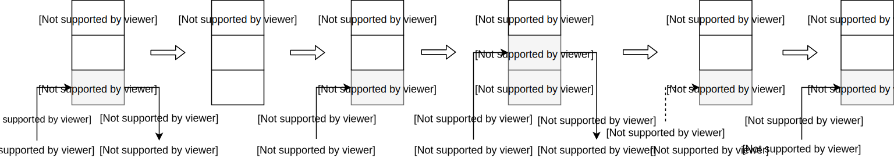
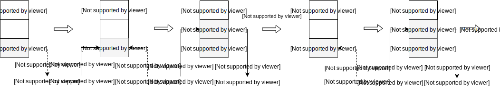

## <center>Управляющие конструкции</center>

* [Условия](#Условия)
   - [Тернарный оператор](#Тернарный-оператор)
   - [Цепочки условий](#Цепочки-условий)
* [Циклы](#Циклы)
  - Циклы со счетчиком
  - Совместные циклы
  - Циклы с предусловием
  - [Пропуск итерации](#Пропуск-итерации)
  - [Досрочный выход из цикла](#Досрочный-выход-из-цикла)

* [Исключения](#Исключения)


# Условия

Для проверки условий и выполнения соответствующих инструкций используется конструкция `if-elif-else`.

Рассмотрим пример тела (содержимого) простой функции, используемой в качестве функции активации в нейронных сетях — ReLU (Rectified Linear Units), которая возвращает положительное или нулевое значение аргумента:

```python
x = 0.4    # 1
if x <= 0: # 2
    x = 0  # 3
else:
    x = x  # 5
print(x)   # 6
```

Условная конструкция получилась достаточно простой и очевидной, поэтому мы вкратце разберем то, как Python будет «интерпретировать» эти 6 строк кода.

Интерпретация, в простом понимании, означает чтение файла с исходным кодом вашей программы и поэтапное ее выполнение.
В Python этапу интерпретации предшествует этап компиляции, то есть, исходный код ваших программ компилируется в [байт-код](https://ru.wikipedia.org/wiki/Байт-код) или другими словами в набор простых инструкций, чем-то напоминающих инструкции CPU, которые и будут выполняться (интерпретироваться) виртуальной машиной Python.
Посмотрим как выглядит байт-код для приведенного выше примера с помощью модуля [`dis`](https://docs.python.org/3/library/dis.html) из стандартной библиотеки:

```python
>>> import dis
>>> dis.dis('x=0.4;\nif x<=0:\n\tx = 0\nelse:\n\tx=x;\nprint(x)')
  1           0 LOAD_CONST               0 (0.4)
              2 STORE_NAME               0 (x)

  2           4 LOAD_NAME                0 (x)
              6 LOAD_CONST               1 (0)
              8 COMPARE_OP               1 (<=)
             10 POP_JUMP_IF_FALSE       18

  3          12 LOAD_CONST               1 (0)
             14 STORE_NAME               0 (x)
             16 JUMP_FORWARD             4 (to 22)

  5     >>   18 LOAD_NAME                0 (x)
             20 STORE_NAME               0 (x)

  6     >>   22 LOAD_NAME                1 (print)
             24 LOAD_NAME                0 (x)
             26 CALL_FUNCTION            1
             28 POP_TOP
             30 LOAD_CONST               2 (None)
             32 RETURN_VALUE
```
Дизассемблированный вывод состоит из нескольких столбцов, краткое описание которых показано на следующем рисунке:


6 строк кода были скомпилированы в 17 инструкций (описание инструкций можно найти тут: [dis/python-bytecode-instructions](https://docs.python.org/3/library/dis.html#python-bytecode-instructions)).
Первые две инструкции соответствуют связыванию имени `x` со значением 0.4.
Следующие четыре инструкции посвящены сравнению `x` с нулем.
Если результат сравнения оказался ложью, то мы переходим (`POP_JUMP_IF_FALSE`) к выполнению инструкции со смещением 18, в противном случае, переменная `x` связывается со значением `0` и мы переходим (`JUMP_FORWARD`) к выполнению инструкции со смещением 22.
Последние шесть инструкций предназначены для вывода содержимого `x`.

Виртуальная машина Python имеет стековую архитектуру, то есть все данные необходимые для выполнения инструкций помещаются (push) на стек или снимаются (pop) с него, такой стек называется стеком данных (data stack или evaluation stack). Для наглядности ниже проиллюстрировано состояние стека при выполнении нескольких первых инструкций:



Как же выполняются интсрукции? Выполнение инструкций происходит в [бесконечном цикле](https://github.com/python/cpython/blob/3.8/Python/ceval.c#L1323) с условием в несколько тысяч строк кода, в качестве примера ниже представлен соответствующий Си-код для инструкции [`COMPARE_OP`](https://github.com/python/cpython/blob/3.8/Python/ceval.c#L2974):

```c 
case TARGET(COMPARE_OP): {
    PyObject *right = POP();
    PyObject *left = TOP();
    PyObject *res = cmp_outcome(tstate, oparg, left, right);
    Py_DECREF(left);
    Py_DECREF(right);
    SET_TOP(res);
    if (res == NULL)
        goto error;
    PREDICT(POP_JUMP_IF_FALSE);
    PREDICT(POP_JUMP_IF_TRUE);
    DISPATCH();
}
```
Инструкция `COMPARE_OP` достаточно простая, если кратко, то выполняются следующие шаги:
* С вершины стека снимаем значение и сохраняем его в переменной `right`;
* В переменную `left` сохраняем значение, которое находится на вершине стека;
* Вызываем функцию сравнения для `left` и `right` и затем результат сохраняем в переменной `res`;
* Уменьшаем счетчик ссылок на `left` и `right`;
* Результат сравнения помещаем на вершину стека «затерев» старое значение;
* Проверяем, что не возникло ошибок при сравнении;
* Пытаемся «предсказать» следующую инструкцию и, если возможно, то переходим к ней;
* Переходим к следующей инструкции на выполнение не по предсказанию.


##  Тернарный оператор

В Python есть условные выражения, которые соответствуют тернарному оператору в других языках программирования:

```python
x = 0.4
x = 0 if x <= 0 else x
print(x)
```
```python
>>> dis.dis("x = 0.4; x = 0 if x <= 0 else x; print(x)")
  1           0 LOAD_CONST               0 (0.4)
              2 STORE_NAME               0 (x)
              4 LOAD_NAME                0 (x)
              6 LOAD_CONST               1 (0)
              8 COMPARE_OP               1 (<=)
             10 POP_JUMP_IF_FALSE       16
             12 LOAD_CONST               1 (0)
             14 JUMP_FORWARD             2 (to 18)
        >>   16 LOAD_NAME                0 (x)
        >>   18 STORE_NAME               0 (x)
             20 LOAD_NAME                1 (print)
             22 LOAD_NAME                0 (x)
             24 CALL_FUNCTION            1
             26 POP_TOP
             28 LOAD_CONST               2 (None)
             30 RETURN_VALUE
```

Как и в других языках программирования в условиях можно использовать несколько логических выражений и объединять их:

## Цепочки условий
Мы можем вкладывать условные конструкции одна в другую, указывая вложенность отступами:


```python
mark = 71
if mark >= 91:
    grade = 'A'
else:
    if mark >= 85:
        grade = 'B'
    else:
        if mark >= 75:
            grade = 'C'
        else:
            if mark >= 67:
                grade = 'D'
            else:
                if mark >= 60:
                    grade = 'E'
                else:
                    grade = 'F'

```
<details><summary>Байт-код для первого примера:</summary>

```python
  1           0 LOAD_CONST               0 (71)
              2 STORE_NAME               0 (mark)

  2           4 LOAD_NAME                0 (mark)
              6 LOAD_CONST               1 (91)
              8 COMPARE_OP               5 (>=)
             10 POP_JUMP_IF_FALSE       18

  3          12 LOAD_CONST               2 ('A')
             14 STORE_NAME               1 (grade)
             16 JUMP_FORWARD            60 (to 78)

  5     >>   18 LOAD_NAME                0 (mark)
             20 LOAD_CONST               3 (85)
             22 COMPARE_OP               5 (>=)
             24 POP_JUMP_IF_FALSE       32

  6          26 LOAD_CONST               4 ('B')
             28 STORE_NAME               1 (grade)
             30 JUMP_FORWARD            46 (to 78)

  8     >>   32 LOAD_NAME                0 (mark)
             34 LOAD_CONST               5 (75)
             36 COMPARE_OP               5 (>=)
             38 POP_JUMP_IF_FALSE       46

  9          40 LOAD_CONST               6 ('C')
             42 STORE_NAME               1 (grade)
             44 JUMP_FORWARD            32 (to 78)

 11     >>   46 LOAD_NAME                0 (mark)
             48 LOAD_CONST               7 (67)
             50 COMPARE_OP               5 (>=)
             52 POP_JUMP_IF_FALSE       60

 12          54 LOAD_CONST               8 ('D')
             56 STORE_NAME               1 (grade)
             58 JUMP_FORWARD            18 (to 78)

 14     >>   60 LOAD_NAME                0 (mark)
             62 LOAD_CONST               9 (60)
             64 COMPARE_OP               5 (>=)
             66 POP_JUMP_IF_FALSE       74

 15          68 LOAD_CONST              10 ('E')
             70 STORE_NAME               1 (grade)
             72 JUMP_FORWARD             4 (to 78)
 17     >>   74 LOAD_CONST              11 ('F')
             76 STORE_NAME               1 (grade)
        >>   78 LOAD_CONST              12 (None)
             80 RETURN_VALUE
```
</details>

А можем использовать более короткую форму записи с помощью `elif`:

```python
mark = 71
if mark >= 91:
    grade = 'A'
elif mark >= 85:
    grade = 'B'
elif mark >= 75:
    grade = 'C'
elif mark >= 67:
    grade = 'D'
elif mark >= 60:
    grade = 'E'
else:
    grade = 'F'
print(grade)
```

<details><summary>Байт-код для второго примера:</summary>

```python
  1           0 LOAD_CONST               0 (71)
              2 STORE_NAME               0 (mark)
  
  3           4 LOAD_NAME                0 (mark)
              6 LOAD_CONST               1 (91)
              8 COMPARE_OP               5 (>=)
             10 POP_JUMP_IF_FALSE       18
  
  4          12 LOAD_CONST               2 ('A')
             14 STORE_NAME               1 (grade)
             16 JUMP_FORWARD            60 (to 78)
  
  5     >>   18 LOAD_NAME                0 (mark)
             20 LOAD_CONST               3 (85)
             22 COMPARE_OP               5 (>=)
             24 POP_JUMP_IF_FALSE       32
  
  6          26 LOAD_CONST               4 ('B')
             28 STORE_NAME               1 (grade)
             30 JUMP_FORWARD            46 (to 78)
  
  7     >>   32 LOAD_NAME                0 (mark)
             34 LOAD_CONST               5 (75)
             36 COMPARE_OP               5 (>=)
             38 POP_JUMP_IF_FALSE       46
  
  8          40 LOAD_CONST               6 ('C')
             42 STORE_NAME               1 (grade)
             44 JUMP_FORWARD            32 (to 78)
  
  9     >>   46 LOAD_NAME                0 (mark)
             48 LOAD_CONST               7 (67)
             50 COMPARE_OP               5 (>=)
             52 POP_JUMP_IF_FALSE       60
 
 10          54 LOAD_CONST               8 ('D')
             56 STORE_NAME               1 (grade)
             58 JUMP_FORWARD            18 (to 78)
 
 11     >>   60 LOAD_NAME                0 (mark)
             62 LOAD_CONST               9 (60)
             64 COMPARE_OP               5 (>=)
             66 POP_JUMP_IF_FALSE       74
 
 12          68 LOAD_CONST              10 ('E')
             70 STORE_NAME               1 (grade)
             72 JUMP_FORWARD             4 (to 78)
 
 14     >>   74 LOAD_CONST              11 ('F')
             76 STORE_NAME               1 (grade)
 
15     >>   78 LOAD_NAME                2 (print)
             80 LOAD_NAME                1 (grade)
             82 CALL_FUNCTION            1
             84 POP_TOP
             86 LOAD_CONST              12 (None)
             88 RETURN_VALUE
```
</details>


Если сравнить байт-код для приведенных примеров, то он окажется полностью идентичным. 
Поэтому разница между двумя формами записи` if-else-if` и `if-elif` только стилистическая.

---
## Циклы

Условно циклы можно разделить на циклы со счетчиком и совместные циклы, но с точки зрения байт-кода они эквивалентны.
Цикл со счётчиком это цикл, в котором некоторая переменная изменяет своё значение от заданного начального значения до конечного значения с некоторым шагом, и для каждого значения этой переменной тело цикла выполняется один раз.

Общая форма записи циклов со счётчиком следующая:

```python
for counter in range(start, stop, step):
    expression
```
Например:

```python
for i in range(1, 10, 2):
    print(i)
```
```python
>>> dis.dis("for i in range(1, 10, 2): print(i)")
  1           0 LOAD_NAME                0 (range)
              2 LOAD_CONST               0 (1)
              4 LOAD_CONST               1 (10)
              6 LOAD_CONST               2 (2)
              8 CALL_FUNCTION            3
             10 GET_ITER
        >>   12 FOR_ITER                12 (to 26)
             14 STORE_NAME               1 (i)
             16 LOAD_NAME                2 (print)
             18 LOAD_NAME                1 (i)
             20 CALL_FUNCTION            1
             22 POP_TOP
             24 JUMP_ABSOLUTE           12
        >>   26 LOAD_CONST               3 (None)
             28 RETURN_VALUE
```

Инструкция [`GET_ITER`](https://github.com/python/cpython/blob/3.8/Python/ceval.c#L3156) возвращает итератор для объекта, который находится на вершине стека (в нашем примере это `range(1,10,2)`).
[`FOR_ITER`](https://github.com/python/cpython/blob/3.8/Python/ceval.c#L3198) возвращает следующее значение из итератора (в нашем примере это 1,3,5,7,9) и помещает его на вершину стека. 
Инструкция `STORE_NAME` снимает значение с вершины стека и связывает его с именем `i`. 
<br>Затем выполняется тело цикла (печать переменной `i`) и все повторяется снова до тех пор, пока итератор не будет исчерпан:



Еще один вид циклов это совместные циклы. 
<br>Такие циклы задают выполнение некоторой операции для объектов из заданного множества, без явного указания порядка перечисления этих объектов.

Общая форма записи совместных циклов следующая
```python
for item in iterable:
    expression
```
Где `iterable` это итерируемый объект. В роли такого объекта могут выступать строки, списки, кортежи, словари, а также любой класс, объявленный с магическими методомами `__iter__` или `__getitem__` (`range`, также является итерируемым объектом).

Последний вид циклов это цикл с предусловием — цикл, который выполняется пока истинно некоторое условие, указанное перед его началом. Это условие проверяется до выполнения тела цикла, поэтому тело может быть не выполнено ни разу (если условие с самого начала ложно).

Общая форма записи циклов с предусловием следующая:

```python
while condition:
    loop_body
```
Пример вычисления факториала числа n:
```python
fact = 1
n = 5
while n:
    fact = fact * n
    n -= 1
print(fact) # 1 * 2 * 3 * 4 * 5 = 120
```
```python
  1           0 LOAD_CONST               0 (1)
              2 STORE_NAME               0 (fact)

  2           4 LOAD_CONST               1 (5)
              6 STORE_NAME               1 (n)

  3     >>    8 LOAD_NAME                1 (n)
             10 POP_JUMP_IF_FALSE       30

  4          12 LOAD_NAME                0 (fact)
             14 LOAD_NAME                1 (n)
             16 BINARY_MULTIPLY
             18 STORE_NAME               0 (fact)

  5          20 LOAD_NAME                1 (n)
             22 LOAD_CONST               0 (1)
             24 INPLACE_SUBTRACT
             26 STORE_NAME               1 (n)
             28 JUMP_ABSOLUTE            8

  6     >>   30 LOAD_NAME                2 (print)
             32 LOAD_NAME                0 (fact)
             34 CALL_FUNCTION            1
             36 POP_TOP
             38 LOAD_CONST               2 (None)
             40 RETURN_VALUE
```
С точки зрения байт-кода цикл `while` не сложнее условных конструкций, если условие ложно, то мы переходим (`POP_JUMP_IF_FALSE`) к первой инструкции после тела цикла, в противном случае выполняется тело цикла и осуществляется безусловный переход (`JUMP_ABSOLUTE`) к повторной проверке условия.


### Досрочный выход из цикла

Выход из цикла осуществляется с помощью оператора `break` и соотвествующей инструкции `JUMP_ABSOLUTE`, которая выполняется при каком-то условии.

### Пропуск итерации
Оператор continue применяется, когда в текущей итерации цикла необходимо пропустить все команды до конца тела цикла, но при этом сам цикл прерываться не должен.

С точки зрения байт-кода оператор `continue` представлен простой инструкцией безусловного перехода `JUMP_ABSOLUTE`.

---
## Исключения

Если вы попробуете вычислить выражение `1 / 0` в интерпретаторе Python, то будет порождено исключение `ZeroDivisionError`. Существует (как минимум) три различимых вида ошибок:

+ Синтаксические ошибки (syntax errors);
+ Логические ошибки (logic errors) - в программировании логической ошибкой называется баг, который приводит к некорректной работе программы, но не к краху программы; 
+ Исключения (exceptions).

Исключения бывают разных типов и тип исключения выводится в сообщении об ошибке, например `ZeroDivisionError`, `IndexError`, `KeyError`, `ValueError` и т.д. 
Для работы с исключениями используется конструкция `try...except`:

```python
try:
    1 / 0
except ZeroDivisionError:
    pass
```
```python
  1           0 SETUP_FINALLY           12 (to 14)
  2           2 LOAD_CONST               0 (1)
              4 LOAD_CONST               1 (0)
              6 BINARY_TRUE_DIVIDE
              8 POP_TOP
             10 POP_BLOCK
             12 JUMP_FORWARD            20 (to 34)

  3     >>   14 DUP_TOP
             16 LOAD_NAME                0 (ZeroDivisionError)
             18 COMPARE_OP              10 (exception match)
             20 POP_JUMP_IF_FALSE       32
             22 POP_TOP
             24 POP_TOP
             26 POP_TOP

  4          28 POP_EXCEPT
             30 JUMP_FORWARD             2 (to 34)
        >>   32 END_FINALLY
        >>   34 LOAD_CONST               2 (None)
             36 RETURN_VALUE
```

Уже должны знакомы инструкции соответствующие второй строке. Но остаются вопросы: «Каким будет порядок выполнения, если было выброшено исключение?», «Как о нем узнает интерпретатор?», «Как оно будет обработано?» и т.д. Начнем с рассмотрения инструкции [`SETUP_FINALLY`](https://github.com/python/cpython/blob/90004fca1cc3c6e3c9b2c3faae5cb1b7d7711648/Python/ceval.c#L3226):

```c
case TARGET(SETUP_FINALLY): {
    PyFrame_BlockSetup(f, SETUP_FINALLY, INSTR_OFFSET() + oparg,
                        STACK_LEVEL());
    DISPATCH();
}
```
Кроме стека данных, о котором говорили ранее, есть еще стек блоков (block stack) ограниченного размера, который используется для «открутки» стека данных на момент входа в `try` или контекстный менеджер `with`.

В обработчике инструкции `SETUP_FINALLY` происходит вызов функции [`PyFrame_BlockSetup`](https://github.com/python/cpython/blob/3.8/Objects/frameobject.c#L741), которая помещает на стек блоков новый «элемент», со следующими аргументами: указатель на текущий фрейм, тип блока, адрес обработчика (адрес инструкции, на которую следует перейти, если было выброшено исключение) и текущая глубина стека данных (до какого момента мы будем «откручивать» стек данных в случае возникновения исключения):

```c 
void
PyFrame_BlockSetup(PyFrameObject *f, int type, int handler, int level)
{
    PyTryBlock *b;
    if (f->f_iblock >= CO_MAXBLOCKS)
        Py_FatalError("XXX block stack overflow");
    b = &f->f_blockstack[f->f_iblock++];
    b->b_type = type;
    b->b_level = level;
    b->b_handler = handler;
}
```

```c 
typedef struct {
    int b_type;                 /* what kind of block this is */
    int b_handler;              /* where to jump to find handler */
    int b_level;                /* value stack level to pop to */
} PyTryBlock;
```
Если инструкция `SETUP_FINALLY` помещает в стек блоков новый элемент, то инструкция `POP_BLOCK` выталкивает элемент из стека блоков:

```c 
case TARGET(POP_BLOCK): {
    PREDICTED(POP_BLOCK);
    PyFrame_BlockPop(f);
    DISPATCH();
}
```
```c
PyTryBlock *
PyFrame_BlockPop(PyFrameObject *f)
{
    PyTryBlock *b;
    if (f->f_iblock <= 0)
        Py_FatalError("XXX block stack underflow");
    b = &f->f_blockstack[--f->f_iblock];
    return b;
}
```
Как же интерпретатор узнает о том, что было порождено исключение? Давайте рассмотрим инструкцию `BINARY_TRUE_DIVIDE`:

```c 
case TARGET(BINARY_TRUE_DIVIDE): {
    PyObject *divisor = POP();
    PyObject *dividend = TOP();
    PyObject *quotient = PyNumber_TrueDivide(dividend, divisor);
    Py_DECREF(dividend);
    Py_DECREF(divisor);
    SET_TOP(quotient);
    if (quotient == NULL)
        goto error;
    DISPATCH();
}
```
Будет вызвана функция `PyNumber_TrueDivide` и, если проследить всю цепочку вызовов, то мы дойдем до функции [`long_true_divide`](https://github.com/python/cpython/blob/3.8/Objects/longobject.c#L3881):

```c 
static PyObject *
long_true_divide(PyObject *v, PyObject *w)
{
    // ...
    a_size = Py_ABS(Py_SIZE(a));
    b_size = Py_ABS(Py_SIZE(b));
    negate = (Py_SIZE(a) < 0) ^ (Py_SIZE(b) < 0);
    if (b_size == 0) {
        PyErr_SetString(PyExc_ZeroDivisionError,
                        "division by zero");
        goto error;
    }
    // ...
  error:
    return NULL;
}
```
Которая возвращает `NULL` при возникновении различного рода ошибок, например, при делении на ноль. [`PyErr_SetString`](https://github.com/python/cpython/blob/3.8/Python/errors.c#L210) позволяет задать тип исключения и сообщение об ошибке. Информация об исключении сохраняется в структуре [`PyThreadState`](https://github.com/python/cpython/blob/3.8/Include/cpython/pystate.h#L51), отражающей состояние текущего потока:
```c
void
_PyErr_Restore(PyThreadState *tstate, PyObject *type, PyObject *value,
               PyObject *traceback)
{
    // ...
    tstate->curexc_type = type;
    tstate->curexc_value = value;
    tstate->curexc_traceback = traceback;
    // ...
}
```

Итак, произошла ошибка деления на ноль и в структуре потока сохранены тип исключения, сообщение об ошибке и трассировочный объект (traceback). 
Давайте вернемся к инструкции `BINARY_TRUE_DIVIDE`, если результатом вызова функции `PyNumber_TrueDivide` является `NULL`, то осуществляется переход к метке [`error`](https://github.com/python/cpython/blob/3.8/Python/ceval.c#L3707), за которой следует метка `exception_unwind`, где и происходит открутка стека данных:

```c 
error:
    // ...
exception_unwind:
        /* Unwind stacks if an exception occurred */
        while (f->f_iblock > 0) {
            /* Pop the current block. */
(1)         PyTryBlock *b = &f->f_blockstack[--f->f_iblock];

            if (b->b_type == EXCEPT_HANDLER) {
                UNWIND_EXCEPT_HANDLER(b);
                continue;
            }
(2)         UNWIND_BLOCK(b);
            if (b->b_type == SETUP_FINALLY) {
                PyObject *exc, *val, *tb;
                int handler = b->b_handler;
                _PyErr_StackItem *exc_info = tstate->exc_info;
                /* Beware, this invalidates all b->b_* fields */
                PyFrame_BlockSetup(f, EXCEPT_HANDLER, -1, STACK_LEVEL());
                PUSH(exc_info->exc_traceback);
                PUSH(exc_info->exc_value);
                if (exc_info->exc_type != NULL) {
                    PUSH(exc_info->exc_type);
                }
                else {
                    Py_INCREF(Py_None);
                    PUSH(Py_None);
                }
                _PyErr_Fetch(tstate, &exc, &val, &tb);
                /* Make the raw exception data
                   available to the handler,
                   so a program can emulate the
                   Python main loop. */
                _PyErr_NormalizeException(tstate, &exc, &val, &tb);
                if (tb != NULL)
                    PyException_SetTraceback(val, tb);
                else
                    PyException_SetTraceback(val, Py_None);
                Py_INCREF(exc);
                exc_info->exc_type = exc;
                Py_INCREF(val);
                exc_info->exc_value = val;
                exc_info->exc_traceback = tb;
                if (tb == NULL)
                    tb = Py_None;
                Py_INCREF(tb);
                PUSH(tb);
                PUSH(val);
                PUSH(exc);
 (3)            JUMPTO(handler);
                /* Resume normal execution */
                goto main_loop;
            }
        } /* unwind stack */

        /* End the loop as we still have an error */
        break;
    } /* main loop */

    assert(retval == NULL);
    assert(_PyErr_Occurred(tstate));
```

При обработке исключения «снимается» один блок со стека блоков, раскручивается стек данных до момента входа в блок (см. макрос `UNWIND_BLOCK`) и наконец осуществляется переход непосредственно к обработчику исключения, в нашем примере это переход к инструкции со смещением 14, где со стека данных последовательно выталкивается три элемента и затем выполняется инструкция [`POP_EXCEPT`](https://github.com/python/cpython/blob/3.8/Python/ceval.c#L2099):

```c 
case TARGET(POP_EXCEPT): {
    PyObject *type, *value, *traceback;
    _PyErr_StackItem *exc_info;
    PyTryBlock *b = PyFrame_BlockPop(f);
    if (b->b_type != EXCEPT_HANDLER) {
        _PyErr_SetString(tstate, PyExc_SystemError,
                            "popped block is not an except handler");
        goto error;
    }
    assert(STACK_LEVEL() >= (b)->b_level + 3 &&
            STACK_LEVEL() <= (b)->b_level + 4);
    exc_info = tstate->exc_info;
    type = exc_info->exc_type;
    value = exc_info->exc_value;
    traceback = exc_info->exc_traceback;
    exc_info->exc_type = POP();
    exc_info->exc_value = POP();
    exc_info->exc_traceback = POP();
    Py_XDECREF(type);
    Py_XDECREF(value);
    Py_XDECREF(traceback);
    DISPATCH();
}
```
