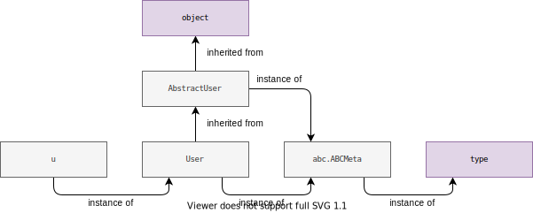
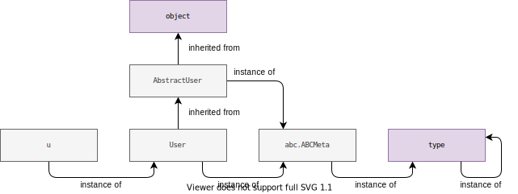
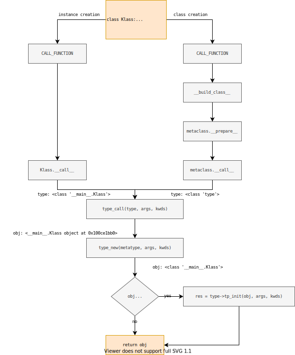

### Создание экземпляра класса

Инстанцирование обычного объекта происходит в 2 этапа: сначала его создание, потом инициализация. Соответственно, сначала запускается метод класса `__new__`, который возвращает объект данного класса, потом выполняется метод класса `__init__`, который инициализирует уже созданный объект.

`def __new__(cls, ...)` — статический метод (но его можно таковым не объявлять), который создает объект класса `cls`.

`def __init__(self, ...)` — метод класса, который инициализирует созданный объект.

Например, объявим класс:

```python
>>> class A(object):
...     pass
```

Для класса `A` не определены ни `__new__`, ни `__init__`. 
В соответствии с алгоритмом поиска атрибутов для класса (типа), который не стоит путать с алгоритмом поиска атрибутов для обычных объектов, когда класс не найдет их в своем `__dict__`, он будет искать эти методы в `__dict__` своих базовых (родительских) классах.

Класс `А` имеет в качестве родителя встроенный класс `object`.
Таким образом он будет их искать в `object.__dict__`

И найдет:
```python
>>> object.__dict__['__init__']
<slot wrapper '__init__' of 'object' objects>
>>> object.__dict__['__new__']
<built-in method __new__ of type object at 0x82e780>
```

Раз есть такие методы, значит, получается, что a = A() аналогичен последовательности вызовов:

```python
a = object.__new__(A)
object.__init__(a)
```

Давайте немного остановимся на том как создаются новые экземпляры класса:

```python
class TestClass(object):
    def f1(self, val):
        return val
    
>>> dis.dis("temp = C()")
  1           0 LOAD_NAME                0 (C)
              2 CALL_FUNCTION            0
              4 STORE_NAME               1 (temp)
              6 LOAD_CONST               0 (None)
              8 RETURN_VALUE
```

Итак, на стек помещается класс `TestClass`, и затем выполняется инструкция `CALL_FUNCTION`:

```c
case TARGET(CALL_FUNCTION): {
    PREDICTED(CALL_FUNCTION);
    PyObject **sp, *res;
    sp = stack_pointer;
    res = call_function(tstate, &sp, oparg, NULL);
    stack_pointer = sp;
    PUSH(res);
    if (res == NULL) {
        goto error;
    }
    DISPATCH();
}
```
```c 
Py_LOCAL_INLINE(PyObject *) _Py_HOT_FUNCTION
call_function(PyThreadState *tstate, PyObject ***pp_stack, Py_ssize_t oparg, PyObject *kwnames)
{
    PyObject **pfunc = (*pp_stack) - oparg - 1;
    PyObject *func = *pfunc;
    PyObject *x, *w;
    Py_ssize_t nkwargs = (kwnames == NULL) ? 0 : PyTuple_GET_SIZE(kwnames);
    Py_ssize_t nargs = oparg - nkwargs;
    PyObject **stack = (*pp_stack) - nargs - nkwargs;

    if (tstate->use_tracing) {
        x = trace_call_function(tstate, func, stack, nargs, kwnames);
    }
    else {
        x = _PyObject_Vectorcall(func, stack, nargs | PY_VECTORCALL_ARGUMENTS_OFFSET, kwnames);
    }

    assert((x != NULL) ^ (_PyErr_Occurred(tstate) != NULL));

    /* Clear the stack of the function object. */
    while ((*pp_stack) > pfunc) {
        w = EXT_POP(*pp_stack);
        Py_DECREF(w);
    }

    return x;
}
```
Произойдёт вызов функции `_PyObject_Vectorcall` ([PEP 590](https://www.python.org/dev/peps/pep-0590/)):
```c
static inline PyObject *
_PyObject_Vectorcall(PyObject *callable, PyObject *const *args,
                     size_t nargsf, PyObject *kwnames)
{
    assert(kwnames == NULL || PyTuple_Check(kwnames));
    assert(args != NULL || PyVectorcall_NARGS(nargsf) == 0);
    vectorcallfunc func = _PyVectorcall_Function(callable);
    if (func == NULL) {
        Py_ssize_t nargs = PyVectorcall_NARGS(nargsf);
        return _PyObject_MakeTpCall(callable, args, nargs, kwnames);
    }
    PyObject *res = func(callable, args, nargsf, kwnames);
    return _Py_CheckFunctionResult(callable, res, NULL);
}
```
```c
PyObject *
_PyObject_MakeTpCall(PyObject *callable, PyObject *const *args, Py_ssize_t nargs, PyObject *keywords)
{
    /* Slow path: build a temporary tuple for positional arguments and a
     * temporary dictionary for keyword arguments (if any) */
    ternaryfunc call = Py_TYPE(callable)->tp_call;

    // ...

    PyObject *result = NULL;
    if (Py_EnterRecursiveCall(" while calling a Python object") == 0)
    {
        result = call(callable, argstuple, kwdict);
        Py_LeaveRecursiveCall();
    }

    // ...

    result = _Py_CheckFunctionResult(callable, result, NULL);
    return result;
}
```
Макрос `PY_TYPE` возвращает тип объекта.
Уже упоминалось, что классы также являются объектами, а следовательно и у них есть тип, другими словами, есть классы, которые порождают другие классы и называются они метаклассами (иногда встречается термин «метатип»):

```c 
>>> type(TestClass)
<class 'type'>
```
По умолчанию метаклассом для всех классов является класс [`type`](https://github.com/python/cpython/blob/3.8/Objects/typeobject.c#L3607), только если мы явно не указали другой метакласс.
Также отметим, что все типы в виртуальной машине CPython представлены структурой [`PyTypeObject`](https://docs.python.org/3/c-api/typeobj.html), содержащей по большей части указатели на функции (слоты), которые определяют поведение объекта.
Таким образом, в листинге выше происходит обращение к слоту `tp_call`, который по умолчанию содержит указатель на функцию `type_call`:

```c
static PyObject *
type_call(PyTypeObject *type, PyObject *args, PyObject *kwds)
{
    PyObject *obj;

    // ...
    obj = type->tp_new(type, args, kwds);
    obj = _Py_CheckFunctionResult((PyObject*)type, obj, NULL);
    if (obj == NULL)
        return NULL;

    // ...
    /* If the returned object is not an instance of type,
       it won't be initialized. */
    if (!PyType_IsSubtype(Py_TYPE(obj), type))
        return obj;

    type = Py_TYPE(obj);
    if (type->tp_init != NULL) {
        int res = type->tp_init(obj, args, kwds);
        // ...
    }
    return obj;
}
```
В качестве первого аргумента в функцию `type_call` передается тип (`TestClass`), затем передаются позиционные и ключевые аргументы, которые были указаны при создании экземпляра класса.
В функции `type_call` происходит вызов конструктора `tp_new` и инициализатора `tp_init`, которые соответствуют магическим методам `__new__` и `__init__`. 
Мы не переопределяли для класса `TestClass` ни один из этих магических методов, поэтому их реализация наследуется от базового класса. Базовым классом для всех объектов в Python является класс [`object`](https://github.com/python/cpython/blob/3.8/Objects/typeobject.c#L4783) (кроме него самого), который представлен структурой `PyBaseObject_Type`. В этой структуре слоты `tp_new` и `tp_init` инициализированы указателями на функции `object_new` и `object_init`, которые и будут вызваны.

Функция `object_init`  не представляет особого интереса. В функции `object_new` происходит выделение памяти под новый объект со следующей структурой:


|Поле	        |Размер в байтах|
| ----	        | ---- |
|`PyGC_Head`	|16 (24 до Python 3.8)|
|`PyObject_HEAD`|	16|
|`__dict__`     |	8|
|`__weakref__`  |	8|
|Всего	        |48 (56 до Python 3.8)|

Где [PyGC_Head](https://github.com/python/cpython/blob/3.8/Include/cpython/objimpl.h#L46) это элемент двойного связанного списка, который используется сборщиком мусора для обнаружения циклических ссылок. `__weakref__` это ссылка на список, так называемых, слабых ссылок (weak reference) на данный объект. В одной из следующих лекций мы будем говорить про управление памятью в CPython, сейчас мы не будем на этом подбробно останавливаться.

И наконец заметим, что словарь `__dict__` для экземпляра класса не создается в процессе выделения памяти. 
При создании нового типа определяется значение `tp_dictoffset`, то есть смещение относительно адреса объекта, по которому находится указатель на словарь (`PyGC_Head` не учитывается в этом смещении):

```python
import ctypes

def magic_dict_ptr(o):
    dict_addr = id(o) + type(o).__dictoffset__
    dict_ptr  = ctypes.cast(dict_addr, ctypes.POINTER(ctypes.py_object))
    return dict_ptr

>>> t = TestClass()
>>> d_ptr = magic_dict_ptr(t)
>>> dptr.contents
py_object(<NULL>)
>>> u.test_attr = 'First'
>>> dptr.contents
py_object({'test_attr': 'First'})
```

Таким образом, фактическое выделение памяти под `__dict__` происходит при первом обращении к нему, например, при добавлении нового атрибута.

Итак, упрощенно процесс создания и инициализации нового объекта можно описать следующими шагами:

1. Мы хотим инстанцировать новый объект некоторого класса: t = TestClass()
2. Происходит вызов метода `__call__` у метакласса: type(TestClass).__call__(TestClass).
3. Вызывается конструктор объекта `__new__`, который возвращает «пустой» объект.
4. Созданный объект передается в инициализатор `__init__` в качестве первого аргумента с именем self (такое имя не является обязательным, но используется по соглашению), за ним передаются все остальные аргументы указанные при инстанцировании класса.
5. У объекта создаются все требуемые атрибуты, например `self.test_attr` = `test_attr`. При первом обращении к `__dict__` под него выделяется память.
6. Инициализированный объект возвращается на место вызова класса, в примере переменная `t` связывается с созданным объектом.


### Методы _vs_ Атрибуты
Метод является атрибутом, но не все атрибуты являются методами. Например, если у нас есть класс

```python

class MyClass(object):
    class_name = 'My Class'

    def my_method(self, name):
        print(f'Hello world {name}!')
```
Этот класс имеет два атрибута, `class_name` и `my_method`. 
Но только `my_method` является методом. **Методы** - это функции, которые принадлежат вашему объекту.
**Атрибуты** являются переменной экземпляра, определенной в классе.
```python
>>> е = MyClass()
>>> type(c.my_method)
<class 'method'>
```
Структура у объекта [`PyMethodObject`](https://github.com/python/cpython/blob/8e5de40f90476249e9a2e5ef135143b5c6a0b512/Include/cpython/classobject.h#L18) следующая:
```c 
typedef struct {
    PyObject_HEAD
    PyObject *im_func;   /* The callable object implementing the method */
    PyObject *im_self;   /* The instance it is bound to */
    PyObject *im_weakreflist; /* List of weak references */
    vectorcallfunc vectorcall;
} PyMethodObject;
```
Где:
* `im_func` хранит указатель на объект функции, реализующий метод.
    ```python
    >>> MyClass.my_method
    <function C.f1 at 0x10b80f040>
    ```
* `im_self` хранит указатель на объект экземпляра, к которому привязан этот метод.
    ```python
    >>> c
    <__main__.C object at 0x10b7cbcd0>
    ```

Поговорим про вызов методов:
```python
>>> c.my_method('Artem'):
'Hello world Artem!'
```
`PyMethodObject` делегирует реальный вызов `my_method` с `im_self` в качестве первого аргумента
```c
static PyObject *
method_call(PyObject *method, PyObject *args, PyObject *kwargs)
{
    PyObject *self, *func;
    /* get im_self */
    self = PyMethod_GET_SELF(method);
    if (self == NULL) {
        PyErr_BadInternalCall();
        return NULL;
    }
    /* get im_func */
    func = PyMethod_GET_FUNCTION(method);
    /* call im_func with im_self as the first argument */
    return _PyObject_Call_Prepend(func, self, args, kwargs);
}
```
### Метод classmethod и staticmethod

```c
typedef struct {
    PyObject_HEAD
    PyObject *cm_callable;
    PyObject *cm_dict;
} classmethod;
```
**classmethod** — это метод, который получает класс в качестве неявного первого аргумента, точно так же, как обычный метод экземпляра получает экземпляр.
    Это означает, что можно использовать класс и его свойства внутри этого метода, а не конкретного экземпляра.
    Методы класса (**classmethod**) используются для определения более одного конструктора в класс
```python
# ------------------ Пример использования метода класса в качестве фабричной функции
class Pizza:
    def __init__(self, ingridients):
        self.ingridients = ingridients
    # Альтернативный конструктор
    @classmethod
    def margherita(cls):
        return cls(['моцарелла', 'помидоры'])
```

```python

typedef struct {
    PyObject_HEAD
    PyObject *sm_callable;
    PyObject *sm_dict;
} staticmethod;
```

Статический метод ничего не знает о классе и имеет дело только с параметрами.
Ни `self` (экземпляр объекта), ни `cls` (класс) не передаются неявно в качестве первого аргумента. Они ведут себя как простые функции, за исключением того, что вы можете вызывать их из экземпляра или класса.

### Разрешение имен атрибтутов
Давайте рассмотрим следующий пример, пусть у нас есть класс `A` и мы обращаемся к атрибуту `x` у экзмепляра этого класса:
```python
source = '''
class A:
    pass

a = A()
a.x
'''
```
Рассмотрим, как CPython определил, что атрибута `x` не существует и следует возбудить исключение `AttributeError`.
Начнем с того, что определим какая инструкция в байт-коде отвечает за поиск атрибута:

```python
import dis
dis.dis(source)
  6          20 LOAD_NAME                1 (a)
             22 LOAD_ATTR                2 (x)
             24 POP_TOP
             26 LOAD_CONST               2 (None)
             28 RETURN_VALUE
```
Инструкция `LOAD_NAME` знакома, она помещает значение `a` на стек. Нас интересует инструкция `LOAD_ATTR`:

```c
case TARGET(LOAD_ATTR): {
    PyObject *name = GETITEM(names, oparg);
    PyObject *owner = TOP();
    PyObject *res = PyObject_GetAttr(owner, name);
    Py_DECREF(owner);
    SET_TOP(res);
    if (res == NULL)
        goto error;
    DISPATCH();
}
```
Макрос `GETITEM` возвращает указатель на искомый атрибут (`x`), а `TOP` возвращает указатель на объект, который находится на вершине стека (`a`), на нем и осуществляется поиск.
Затем происходит вызов функции `PyObject_GetAttr`, которая определена в [`Objects/objects.c`](https://github.com/python/cpython/blob/3.8/Objects/object.c#L923):

```c
PyObject *
PyObject_GetAttr(PyObject *v, PyObject *name)
{
    PyTypeObject *tp = Py_TYPE(v);

    if (!PyUnicode_Check(name)) {
        PyErr_Format(PyExc_TypeError,
                     "attribute name must be string, not '%.200s'",
                     name->ob_type->tp_name);
        return NULL;
    }
    if (tp->tp_getattro != NULL)
        return (*tp->tp_getattro)(v, name);
    if (tp->tp_getattr != NULL) {
        const char *name_str = PyUnicode_AsUTF8(name);
        if (name_str == NULL)
            return NULL;
        return (*tp->tp_getattr)(v, (char *)name_str);
    }
    PyErr_Format(PyExc_AttributeError,
                 "'%.50s' object has no attribute '%U'",
                 tp->tp_name, name);
    return NULL;
}
```
Во-первых, мы получаем ссылку на тип объекта класса (в данном случае `A`), который фактически определяет допустимые операции над объектом.
Затем осуществляется проверка какой из методов доступен: `tp_getattro` или `tp_getattr`.
Оба метода, или как их называют - слота, содержат указатель на одну из трех возможных функций: `PyObject_GenericGetAttr`, `slot_tp_getattro` или `slot_tp_getattr_hook`, одна из которых и будет вызвана для выполнения поиска атрибута.
Остается выяснить какая именно функция.

Решение о том какую именно функцию следует установить в слот `tp_getattro` происходит во время создания типа (в нашем случае класса `A`), а именно в вызове функции `type_new`. 
В конце вызова `type_new` происходит вызов диспетчера слотов `fixup_slot_dispatcher`, который отвечает за инициализацию слотов с учетом переопределенных пользователем магических методов, другими словами, [будет выбрана](https://github.com/python/cpython/blob/3.8/Objects/typeobject.c#L7193) или пользовательская реализация (`specific`) или реализация по умолчанию (`generic`).
Итак, если пользователь переопределил `__getattr__` или `__getattribute__`, то будет установлен `slot_tp_getattr_hook`, иначе `PyObject_GenericGetAttr`.

Начнем с рассмотрения принципов работы функции [`PyObject_GenericGetAttr`](https://github.com/python/cpython/blob/3.8/Objects/object.c#L1326), которая чаще всего вызывается при осуществлении поиска атрибутов:
```c 
PyObject *
PyObject_GenericGetAttr(PyObject *obj, PyObject *name)
{
    return _PyObject_GenericGetAttrWithDict(obj, name, NULL, 0);
}

PyObject *
_PyObject_GenericGetAttrWithDict(PyObject *obj, PyObject *name,
                                 PyObject *dict, int suppress)
{
    PyTypeObject *tp = Py_TYPE(obj);
    ...
    descr = _PyType_Lookup(tp, name);                       // (1)

    f = NULL;
    if (descr != NULL) {
        Py_INCREF(descr);
        f = descr->ob_type->tp_descr_get;
        if (f != NULL && PyDescr_IsData(descr)) {           // (2)
            res = f(descr, obj, (PyObject *)obj->ob_type);
            ...
            goto done;
        }
    }

    if (dict == NULL) {                                     // (3)
        /* Inline _PyObject_GetDictPtr */
        dictoffset = tp->tp_dictoffset;
        if (dictoffset != 0) {
            ...
            dictptr = (PyObject **) ((char *)obj + dictoffset);
            dict = *dictptr;
        }
    }
    if (dict != NULL) {                                     // (4)
        Py_INCREF(dict);
        res = PyDict_GetItemWithError(dict, name);
        if (res != NULL) {
            ...
            goto done;
        }
        ...
    }

    if (f != NULL) {                                        // (5)
        res = f(descr, obj, (PyObject *)Py_TYPE(obj));
        ...
        goto done;
    }

    if (descr != NULL) {                                    // (6)
        res = descr;
        descr = NULL;
        goto done;
    }

    if (!suppress) {
        PyErr_Format(PyExc_AttributeError,
                     "'%.50s' object has no attribute '%U'",
                     tp->tp_name, name);
    }
  done:
    ...
    return res;
}
```

1. Поиск атрибута осуществляется сначала в словаре класса, а затем в родительских классах в порядке определяемым MRO.
2. Если атрибут был найден, то проверяется является ли найденный атрибут дескриптором данных (data descriptior, дескриптор у которого определены методы `__get__` и `__set__`) и если является, то происходит вызов метода `__get__` у дескриптора.
3. Получение смещения для словаря экземпляра класса, а затем по смещению и самого словаря (`f.__dict__`).
4. Если атрибут не был найден в цепочке MRO или не является дескпритором данных, то поиск осуществляется в словаре экземпляра класса.
5. Если в словаре экземпляра атрибут не найден, но ранее был найден в цепочке MRO, то проверяется является ли найденный атрибут дескриптором не данных (non-data descriptor, дескриптор у которого определен только метод `__get__`) и если является, то вызывается метод `__get__` у дескриптора.
6. Если атрибут не является дескриптором не данных, но был найден в цепочке MRO, то возвращается найденное значение.
7. Атрибут не найден, порождается исключение `AttributeError`.

Перейдем к функции `slot_tp_getattr_hook`:

```c
static PyObject *
slot_tp_getattro(PyObject *self, PyObject *name)
{
    PyObject *stack[1] = {name};
    return call_method(self, &PyId___getattribute__, stack, 1);
}

static PyObject *
slot_tp_getattr_hook(PyObject *self, PyObject *name)
{
    PyTypeObject *tp = Py_TYPE(self);
    ...
    getattr = _PyType_LookupId(tp, &PyId___getattr__);
    if (getattr == NULL) {
        tp->tp_getattro = slot_tp_getattro;
        return slot_tp_getattro(self, name);
    }
    ...
    getattribute = _PyType_LookupId(tp, &PyId___getattribute__);
    if (getattribute == NULL ||
        (Py_TYPE(getattribute) == &PyWrapperDescr_Type &&
         ((PyWrapperDescrObject *)getattribute)->d_wrapped ==
         (void *)PyObject_GenericGetAttr))
        res = PyObject_GenericGetAttr(self, name);
    else {
        Py_INCREF(getattribute);
        res = call_attribute(self, getattribute, name);
        Py_DECREF(getattribute);
    }
    if (res == NULL && PyErr_ExceptionMatches(PyExc_AttributeError)) {
        PyErr_Clear();
        res = call_attribute(self, getattr, name);
    }
    Py_DECREF(getattr);
    return res;
}
```

Задачей функции `slot_tp_getattr_hook` является определить какой из магических методов `__getattr__` или `__getattribute__` был переопределен пользователем.
Сначала проверяется был ли переопределен метод `__getattr__`, если нет, то это означает, что переопределен метод `__getattribute__` и слот подменяется на функцию `slot_tp_getattro`, которая просто вызывает пользовательский метод.
В противном случае интерпретатор проверяет был ли переопределен метод `__getattribute__`, так как вызов этого метода происходит безусловно. 
Здесь следует иметь в виду, что все пользовательские типы имеют своим предком [`PyBaseObject_Type`](https://github.com/python/cpython/blob/3.8/Objects/typeobject.c#L4783) (object), у которого в слот `tp_getattro` установлена функция `PyObject_GenericGetAttr`, которая и будет реализацией по умолчанию для метода `__getattribute__`.
Если в результате вызова `__getattribute__` атрибут не был найден и было порождено исключение `AttributeError`, то будет вызван переопределенный метод `__getattr__`.

### Про метаклассы: 

Классы в Python - это тоже объекты. Созданием классов заведуют метаклассы. 
В обычном случае для создания классов используется метакласс `type`. 
`type` работает следующим образом: `type`(«имя класса», «кортеж родительских классов», «словарь, содержащий атрибуты и их значения»)
```python
NewClass = type('NewClass', (), {})
```
В примере был создан класс NewClass без использования литерала **class**

```python
class AbstractUser(metaclass=abc.ABCMeta):
    @abc.abstractmethod
    def is_anonymous(self) -> bool:
        pass


class User(AbstractUser):
    def __init__(self, username: str) -> None:
        self.username = username

    def is_anonymous(self) -> bool:
        return False

>>> u = User()
>>> type(u)
<class '__main__.User'>
>>> isinstance(u, User)
True
>>> type(User)
<class 'abc.ABCMeta'>
>>> isinstance(User, abc.ABCMeta)
True
>>> type(abc.ABCMeta)
<class 'type'>
>>> isinstance(abc.ABCMeta, type)
True
```


Типом `type` является... тоже `type`:
```python

<class 'type'>
>>> isinstance(type, type)
True
```
Если мы посмотрим на определение структуры `PyType_Type`, то заметим, что type в качестве типа содержит ссылку на себя самого:

```c 
PyTypeObject PyType_Type = {
    PyVarObject_HEAD_INIT(&PyType_Type, 0)
    "type",                                     /* tp_name */
    // ...
    offsetof(PyTypeObject, tp_vectorcall),      /* tp_vectorcall_offset */
    // ...
    (ternaryfunc)type_call,                     /* tp_call */
    // ...
    offsetof(PyTypeObject, tp_dict),            /* tp_dictoffset */
    type_init,                                  /* tp_init */
    0,                                          /* tp_alloc */
    type_new,                                   /* tp_new */
    // ...
};
```


Давайте сначала рассмотрим в общих чертах как происходит определение нового класса на примере класса пользователь определенного выше.

Если не был явно указан метакласс, то берется метакласс наиболее подходящего родителя:
```python
>>> meta = type(AbstractUser)
>>> meta
abc.ABCMeta
```
Затем мы «изолируем» тело класса:

```python
>>> cls_body = """
NUM_EYES = 2

def __init__(self, username: str) -> None:
    self.username = username

def is_anonymous(self) -> bool:
return False
"""
```
На следующем шаге будет создан (подготовлен) словарь атрибутов класса:

```python
>>> cls_dict = meta.__prepare__("User", (AbstractUser,))
>>> cls_dict
{}
```
На третьем шаге выполняется тело класса в окружении глобального и локального (словаря атрибутов) пространства имен:

```python
>>> exec(cls_body, globals(), cls_dict)
>>> cls_dict
{
'__init__': <function __init__ at 0x10d6c2d30>,
'is_anonymous': <function is_anonymous at 0x10d6c2700>
}
```
Как видно, результатом выполнения этого шага является заполнение словаря атрибутов класса. Затем создается сам класс:

```python
>>> User = meta.__new__(meta, "User", (AbstractUser,), cls_dict)
>>> bob = User("bob")
>>> bob.username
'bob'
```
И наконец, если для класса в метаклассе был определен инициализатор, то он будет вызван:

```python
meta.__init__(User, "User", (AbstractUser,), cls_dict)
```
Последние шаги должны вам напоминать создание экземпляра класса, дальше мы увидим, что они и правда очень похожи.

```python
class Meta(type):
  @classmethod
  def __prepare__(meta, name, bases):
    print(f"__prepare__ was called on {meta.__name__} with {name}, {bases}")
    return super().__prepare__(meta, name, bases)

  def __new__(meta, name, bases, kwds):
    print(f"__new__ was called on {meta.__name__} with {name}, {bases}, {kwds}")
    obj = super().__new__(meta, name, bases, kwds)
    return obj

  def __init__(cls, name, bases, kwds):
    print(f"__init__ was called on {cls.__name__} with {name}, {bases}, {kwds}")
    super().__init__(name, bases, kwds)
```
```python
>>> User = Meta("User", (), {"__init__": __init__, "get_username": get_username})
__new__ was called on Meta with User, (), {'__init__': <function __init__ at 0x1039693a0>, 'get_username': <function get_username at 0x103969430>}
__init__ was called on User with User, (), {'__init__': <function __init__ at 0x1039693a0>, 'get_username': <function get_username at 0x103969430>}
```
```python
>>> class User(metaclass=Meta):
...     def __init__(self, username):
...         self.username = username
...
...     def get_username(self):
...         return self.username
...
__prepare__ was called on Meta with User, ()
__new__ was called on Meta with User, (), {'__module__': '__main__', '__qualname__': 'User', '__init__': <function User.__init__ at 0x103969e50>, 'get_username': <function User.get_username at 0x103969ee0>}
__init__ was called on User with User, (), {'__module__': '__main__', '__qualname__': 'User', '__init__': <function User.__init__ at 0x103969e50>, 'get_username': <function User.get_username at 0x103969ee0>}
```
Давайте теперь подробней рассмотрим как происходит создание нового класса:

```python
>>> source = """
... class User(AbstractUser):
...     @property
...     def is_anonymous(self) -> bool:
...         return False
... """
>>> dis.dis(source)
  2           0 LOAD_BUILD_CLASS
              2 LOAD_CONST               0 (<code object User at 0x100df9660, file "<dis>", line 2>)
              4 LOAD_CONST               1 ('User')
              6 MAKE_FUNCTION            0
              8 LOAD_CONST               1 ('User')
             10 LOAD_NAME                0 (AbstractUser)
             12 CALL_FUNCTION            3
             14 STORE_NAME               1 (User)
             16 LOAD_CONST               2 (None)
             18 RETURN_VALUE
```
Инструкция `LOAD_BUILD_CLASS` помещает на стек встроенную функцию `__build_class__`, `LOAD_CONST` помещает на стек объект кода, имя класса и создает функцию:

```c 
case TARGET(MAKE_FUNCTION): {
    PyObject *qualname = POP();
    PyObject *codeobj = POP();
    PyFunctionObject *func = (PyFunctionObject *)
        PyFunction_NewWithQualName(codeobj, f->f_globals, qualname);
    // ...
    PUSH((PyObject *)func);
    DISPATCH();
}
```

```python
>>> __builtins__.__build_class__ = lambda *args, **kwargs: print(args, kwargs)
>>> class A: pass
... 
(<function A at 0x104fadaf0>, 'A') {}
```
```python
dis.dis("class User: pass")
  1           0 LOAD_BUILD_CLASS
              2 LOAD_CONST               0 (<code object User at 0x10b771390 ...>)
              4 LOAD_CONST               1 ('User')
              6 MAKE_FUNCTION            0
              8 LOAD_CONST               1 ('User')
             10 CALL_FUNCTION            2
             12 STORE_NAME               0 (User)
             14 LOAD_CONST               2 (None)
             16 RETURN_VALUE

Disassembly of <code object User at 0x10b771390 ...>:
  1           0 LOAD_NAME                0 (__name__)
              2 STORE_NAME               1 (__module__)
              4 LOAD_CONST               0 ('User')
              6 STORE_NAME               2 (__qualname__)
              8 LOAD_CONST               1 (None)
             10 RETURN_VALUE
```
```c
case TARGET(LOAD_BUILD_CLASS): {
    _Py_IDENTIFIER(__build_class__);

    PyObject *bc;
    if (PyDict_CheckExact(f->f_builtins)) {
        bc = _PyDict_GetItemIdWithError(f->f_builtins, &PyId___build_class__);
        // ...
        Py_INCREF(bc);
    }
    // ...
    PUSH(bc);
    DISPATCH();
}
```

`CALL_FUNCTION` вызывает `___build_class__` для создания класса

```c
/* AC: cannot convert yet, waiting for *args support */
static PyObject *
builtin___build_class__(PyObject *self, PyObject *const *args, Py_ssize_t nargs,
                        PyObject *kwnames)
{
    PyObject *func, *name, *bases, *mkw, *meta, *winner, *prep, *ns, *orig_bases;
    PyObject *cls = NULL, *cell = NULL;
    int isclass = 0;   /* initialize to prevent gcc warning */

    // ...
    func = args[0];   /* Better be callable */
    // ...
    name = args[1];
    // ...
    orig_bases = _PyTuple_FromArray(args + 2, nargs - 2);
    if (orig_bases == NULL)
        return NULL;

    bases = update_bases(orig_bases, args + 2, nargs - 2);
    // ...

    if (meta == NULL) {
        /* if there are no bases, use type: */
        if (PyTuple_GET_SIZE(bases) == 0) {
            meta = (PyObject *) (&PyType_Type);
        }
        /* else get the type of the first base */
        else {
            PyObject *base0 = PyTuple_GET_ITEM(bases, 0);
            meta = (PyObject *) (base0->ob_type);
        }
        Py_INCREF(meta);
        isclass = 1;  /* meta is really a class */
    }

    // ...
    /* else: meta is not a class, so we cannot do the metaclass
       calculation, so we will use the explicitly given object as it is */
    if (_PyObject_LookupAttrId(meta, &PyId___prepare__, &prep) < 0) {
        ns = NULL;
    }
    else if (prep == NULL) {
        ns = PyDict_New();
    }
    else {
        PyObject *pargs[2] = {name, bases};
        ns = _PyObject_FastCallDict(prep, pargs, 2, mkw);
        Py_DECREF(prep);
    }
    // ...
    cell = PyEval_EvalCodeEx(PyFunction_GET_CODE(func), PyFunction_GET_GLOBALS(func), ns,
                             NULL, 0, NULL, 0, NULL, 0, NULL,
                             PyFunction_GET_CLOSURE(func));
    if (cell != NULL) {
        // ...
        PyObject *margs[3] = {name, bases, ns};
        cls = _PyObject_FastCallDict(meta, margs, 3, mkw);
        // ...
    }
    // ...
    return cls;
}
```

1. Первый The first chunk of code deals with extracting the arguments and setting defaults.
2. Next, if no metaclass is supplied, BBC looks at the base classes and takes the metaclass of the first base class. If there are no base classes, the default metaclass type is used.
3. If the metaclass is really a class (note that in Python any callable can be given as a metaclass), look at the bases again to determine "the most derived" metaclass.
4. At this point BBC has a metaclass [5], so it starts by calling its `__prepare__` method to create a namespace dictionary for the class. If there's no such method, an empty dict is used
5. The function argument is invoked, passing the namespace dict as the only argument. If we look back at the disassembly of this function (the second one), we see that the first argument is placed into the `f_locals` attribute of the frame (with the `STORE_LOCALS` instruction). In other words, this dictionary is then used to populate the class attributes. The function itself returns `None` - its outcome is modifying the namespace dictionary.
6. Finally, the metaclass is called with the name, list of bases and namespace dictionary as arguments.

```
(gdb) p ((PyFunctionObject *)func)->func_name
$1 = 'AbstractUser'
(gdb) p name
$2 = 'AbstractUser'
(gdb) p bases
$3 = ()
(gdb) p ns
$4 = {'__module__': '__main__', '__qualname__': 'AbstractUser', 'is_anonymous': <function at remote 0x100fb741
0>}
(gdb) p ((PyTypeObject*)meta)->tp_name 
$5 = 0x1003ddd46 "type"
```


Упрощенный пример:

```python
class MyMeta(type):
    @classmethod
    def __prepare__(cls, name, bases, **kwargs):
        print(">> Meta: __prepare__ Подготавливается", name, bases, kwargs)
        return dict()
    def __new__(cls, name, bases, classdict):
        print(">> Meta: __new__ Cоздается", name, bases, classdict)
        return type.__new__(cls, name, bases, classdict)
    
class NewClass(metaclass=MyMeta):
    print("> Class: Начало определения методов")
    def __init__(self): 
        pass
    def bar(self): 
        pass
    print("> Class: Конец определения методов")
# >> Meta. __prepare__: Подготавливается NewClass () {}
# > Class: Начало определения методов
# > Class: Конец определения методов
# >> Meta. __new__: Cоздается NewClass () {'__module__': '__main__', '__qualname__': 'NewClass', '__init__': <function NewClass.__init__>, 'bar': <function NewClass.bar>}
```
    
<br>Метод `__prepare__(cls, clsname, bases)` вызывается при старте определения класса вместе с именем класса и базовыми классами.
<br>● Этот вызов должен вернуть объект отображения, который используется для создания пространства имен класса (в этом словаре будут храниться атрибуты класса).
<br>`__new__(cls, clsname, bases, clsdict)` — это метод, который создает объект класса и возвращает его.
<br>● Вызывается перед созданием класса и обычно используется если метакласс изменяет определение класса (содержимое словаря класса)
<br>Метод `__init__(cls, clsname, bases, clsdict)` вызывается последним и используется для выполнения дополнительных шагов инициализации.
<br>● Вызывается после создания класса и обычно используется для проверки словаря классов, базовых классов и т.д.
<br>При написании метаклассов обычно определяют только один из методов `__new__` или `__init__`.

Метаклассы используются для реализации различных паттернов создания экземпляров.

Пример использования метакласса для реализации паттерна проектирования «Одиночка» — класса из которого можно создать только один экземпляр
```python
class Singleton(type):
    def __init__(self, *args, **kwargs):
        self.__instance = None
        super().__init__(*args, **kwargs)

    def __call__(self, *args, **kwargs):
        if self.__instance is None:
            self.__instance = super().__call__(*args, **kwargs)
            return self.__instance
        else:
            return self.__instance
        
class Spam(metaclass=Singleton):
    def __init__(self):
        print('Creating Spam')
        
a = Spam() # Все эти экземпляры одинаковы
b = Spam(); a is b # Выхлоп / True /
```
Пример использования метакласса для кеширования экземпляров:

```python
class Cached(type):
    def __init__(self, *args, **kwargs):
        super().__init__(*args, **kwargs)
        self.__cache = weakref.WeakValueDictionary()

    def __call__(self, *args):
        if args in self.__cache:
            return self.__cache[args]
        else:
            obj = super().__call__(*args)
            self.__cache[args] = obj
            return obj
        
class Spam(metaclass=Cached):
    def __init__(self, name):
        self.name = name
        
a = Spam('Artem')
b = Spam('Diana'); a is b # Выхлоп / False /
c = Spam('Artem'); a is c # Выхлоп / True /
```