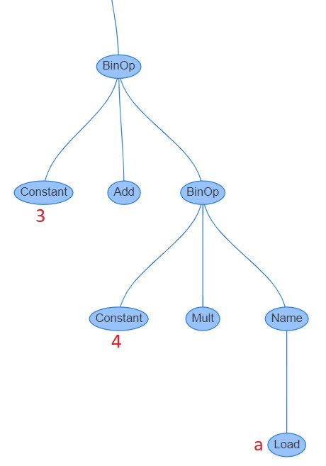
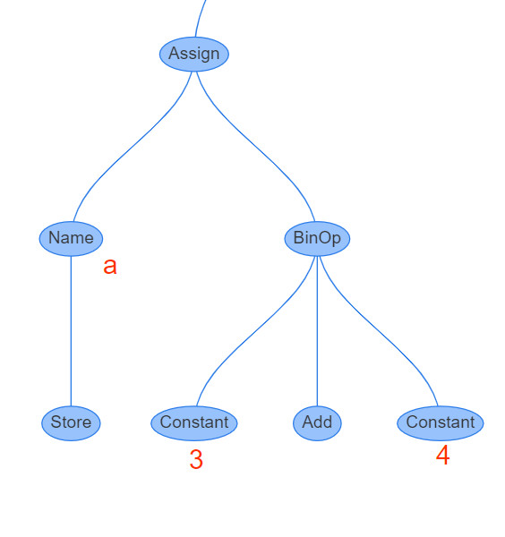
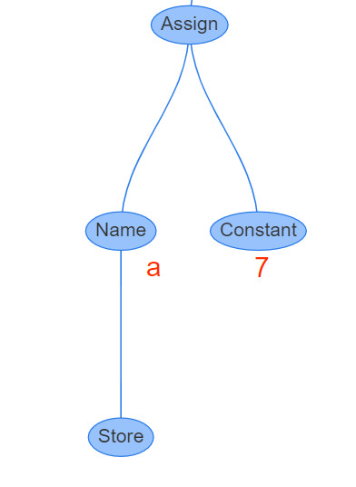
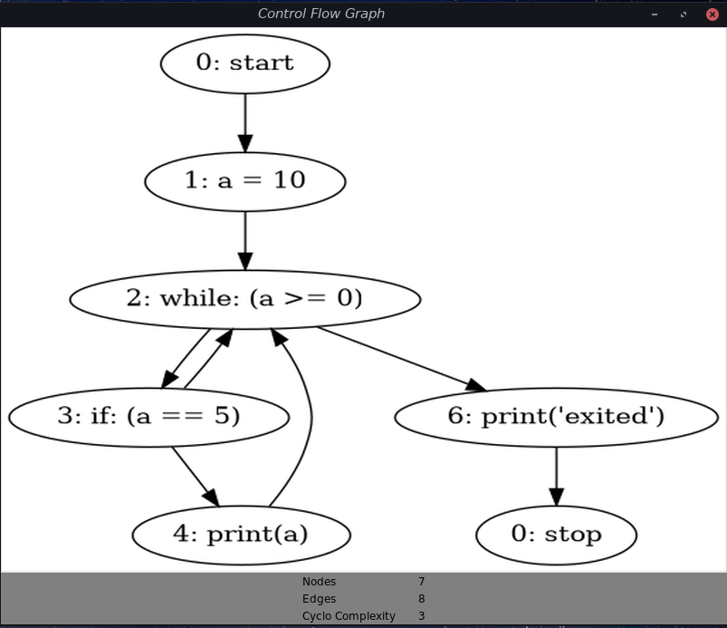

1. Разбиение исходного python кода в на токены
2. Преобразование токенов в дерево парсинга (**CST**).
3. Преобразование дерева парсинга в абстрактные синтаксическое дерево (**AST**).
4. Генерация таблицы символов.
5. Создание **PyObject** из **AST**. Этот шаг включает в себя:
    - Преобразование **AST** в граф потока управления *CFG*.
    - Получение объекта кода из графа потока управления.


## <center>Парсинг и анализ исходного кода</center>

Для анализа кода в CPython используются две структуры, **Concrete
Syntax Tree** (**CST**, дерево синтаксического парсинга) и **Abstract Syntax Tree**(**AST**, синтаксическое дерево).


## Лексический анализ и дерево парсинга (CST)

Процесс вызова разбиения на лексемы и синтаксического анализа можно проиллюстрировать следующим образом:


Сначала код разбивается на лексемы, все лексемы определены в [`Grammar/Tokens`](https://github.com/python/cpython/blob/bb3e0c240bc60fe08d332ff5955d54197f79751c/Grammar/Tokens):

```txt
ENDMARKER
NAME
NUMBER
STRING
NEWLINE
INDENT
DEDENT

LPAR                    '('
RPAR                    ')'
LSQB                    '['
RSQB                    ']'
COLON                   ':'
COMMA                   ','
SEMI                    ';'
PLUS                    '+'
MINUS                   '-'
STAR                    '*'
[...]
```
К примеру, токен `NAME` представляет собой название некой переменной, функции, класса или модуля.
<br>[tokenize](https://github.com/python/cpython/blob/3.9/Lib/tokenize.py) Модуль, который представляет лексический парсер исходного кода Python, реализованный на Python.
```python
Whitespace = r'[ \f\t]*'
Comment = r'#[^\r\n]*'
Ignore = Whitespace + any(r'\\\r?\n' + Whitespace) + maybe(Comment)
Name = r'\w+'

Intnumber = group(Hexnumber, Binnumber, Octnumber, Decnumber)
Exponent = r'[eE][-+]?[0-9](?:_?[0-9])*'
Pointfloat = group(r'[0-9](?:_?[0-9])*\.(?:[0-9](?:_?[0-9])*)?',
                   r'\.[0-9](?:_?[0-9])*') + maybe(Exponent)
Expfloat = r'[0-9](?:_?[0-9])*' + Exponent
Floatnumber = group(Pointfloat, Expfloat)
Number = group(Imagnumber, Floatnumber, Intnumber)
```
Потом используется LL-грамматика, определённая в [`Grammar/python.gram`](https://github.com/python/cpython/blob/main/Grammar/python.gram).

> Парсер Python — это синтаксический анализатор [LL (1)](https://en.wikipedia.org/wiki/LL_parser).
> <br> Модуль `Grammar/python.gram` содержит расширенную форму Бэкуса — Наура *(Extended Backus-Naur Form (EBNF))* со спецификацией грамматики языка Python.

_Отрывки синтаксиса BNF в Python:_ 
```python
del_stmt: 'del' exprlist
pass_stmt: 'pass'
flow_stmt: break_stmt | continue_stmt | return_stmt | raise_stmt | 
        yield_stmt
break_stmt: 'break'
continue_stmt: 'continue'
return_stmt: 'return' [testlist]
raise_stmt: 'raise' [test ['from' test]]
assert_stmt: 'assert' test [',' test]
import_stmt: import_name | import_from
import_name: 'import' dotted_as_names
import_from: ('from' (('.' | '...')* dotted_name | ('.' | '...')+)
              'import' ('*' | '(' import_as_names ')' | import_as_names))
```
```python
# Arithmetic operators
# --------------------

sum[expr_ty]:
    | a=sum '+' b=term { _PyAST_BinOp(a, Add, b, EXTRA) }
    | a=sum '-' b=term { _PyAST_BinOp(a, Sub, b, EXTRA) }
    | term

term[expr_ty]:
    | a=term '*' b=factor { _PyAST_BinOp(a, Mult, b, EXTRA) }
    | a=term '/' b=factor { _PyAST_BinOp(a, Div, b, EXTRA) }
    | a=term '//' b=factor { _PyAST_BinOp(a, FloorDiv, b, EXTRA) 
```

Потом строится само дерево парсинга. То есть **CST**—это просто отображение грамматики в древовидную форму.

Перейдём к реальному примеру.  Рассмотрим как, простое арифместическое выражение `a + 1` превращается в дерево парсинга (**CST**):

На первом шаге выражение разбивается на следующие лексемы:

<details><summary>Разбиение на токены:</summary>

```python
from tokenize import tokenize
from io import BytesIO
from token import tok_name
from pprint import pprint

tokens = tokenize(BytesIO(b"a+1").readline)
pprint([(token.string, tok_name[token.type]) for token in tokens])
```
</details>

```python
[('utf-8', 'ENCODING'),
('a', 'NAME'),
('+', 'OP'),
('1', 'NUMBER'),
('', 'NEWLINE'),
('', 'ENDMARKER')]
```

<details><summary>Использование модуля parser для получения СST</summary>

```python
from symbol import sym_name
from token import tok_name
import parser
from pprint import pprint

def lex(expression):
    lexicon = tok_name | sym_name
    st = parser.expr(expression)
    st_list = parser.st2list(st)

    def replace(l: list):
        r = []
        for i in l:
            if isinstance(i, list):
                r.append(replace(i))
            else:
                if i in lexicon:
                    r.append(lexicon[i])
                else:
                    r.append(i)
        return r

    return replace(st_list)
pprint(lex('a + 1'))
```
</details>

```python
>>> pprint(lex('a + 1'))
['eval_input',
 ['testlist',
  ['test',
   ['or_test',
    ['and_test',
     ['not_test',
      ['comparison',
       ['expr',
        ['xor_expr',
         ['and_expr',
          ['shift_expr',
           ['arith_expr',
            ['term',
             ['factor', ['power', ['atom_expr', ['atom', ['NAME', 'a']]]]]],
            ['PLUS', '+'],
            ['term',
             ['factor',
              ['power', ['atom_expr', ['atom', ['NUMBER', '1']]]]]]]]]]]]]]]]],
 ['NEWLINE', ''],
 ['ENDMARKER', '']]
```
В данном выводе можно наблюдать символы в нижнем регистре, полученные из LL-грамматики, например, `arith_expr`, и значения лексем в верхнем регистре, такие как `NUMBER`.

В итоге получилось следующее дерево парсинга (**CST**):


## Абстрактное синтаксическое дерево (AST)

Следующий этап в интерпретаторе CPython состоит в преобразовании синтаксическим анализатором дерева парсинга (**CST**) в нечто более логичное, что можно исполнить.

Абстрактное синтаксическое дерево отличается от дерева парсинга (**СST**) тем, что в нём отсутствуют узлы и рёбра для тех синтаксических правил, которые не влияют на семантику программы.
Классическим примером такого отсутствия являются группирующие скобки, так как в **AST** группировка операндов явно задаётся структурой дерева.
Итак, **AST** помогает представить программу в независимом от синтаксиса виде.

Пример **AST** для простого арифметического выражения `3 + 4*a`:
```python
>> import ast
>>> ast.dump(ast.parse("3 + 4*a"))

BinOp(
  left  = Num(3),
  op    = Add(),
  right = BinOp(
            left  = Num(4),
            op    = Mult(),
            right = Name('a')
          )
)
```


`BinOp` означает `Binary Operation` и просто указывает на то, что в таких операциях как сложение и умножение – по два операнда.

## Оптимизации внутри AST

### Сворачивание BinOp

```python
>>> import dis
>>> dis.dis("day_sec = 24 * 60 * 60")

0 LOAD_CONST               0 (86400)
2 STORE_NAME               0 (day_sec)
4 LOAD_CONST               1 (None)
6 RETURN_VALUE
```

Интерпретатор CPython во время построения абстрактного синтаксического дерева свернул арифметическое выражение, `24 * 60 * 60 ` в 86400.

<details><summary>Исходники сворачивания BinOp:</summary>

```c
static int
fold_binop(expr_ty node, PyArena *arena, int optimize)
{
    expr_ty lhs, rhs;
    lhs = node->v.BinOp.left;
    rhs = node->v.BinOp.right;
    if (lhs->kind != Constant_kind || rhs->kind != Constant_kind) {
        return 1;
    }

    PyObject *lv = lhs->v.Constant.value;
    PyObject *rv = rhs->v.Constant.value;
    PyObject *newval;

    switch (node->v.BinOp.op) {
    case Add:
        newval = PyNumber_Add(lv, rv);
        break;
    case Sub:
        newval = PyNumber_Subtract(lv, rv);
        break;
    case Mult:
        newval = safe_multiply(lv, rv);
        break;
    case Div:
        newval = PyNumber_TrueDivide(lv, rv);
        break;
    case FloorDiv:
        newval = PyNumber_FloorDivide(lv, rv);
        break;
    case Mod:
        newval = safe_mod(lv, rv);
        break;
    case Pow:
        newval = safe_power(lv, rv);
        break;
    case LShift:
        newval = safe_lshift(lv, rv);
        break;
    case RShift:
        newval = PyNumber_Rshift(lv, rv);
        break;
    case BitOr:
        newval = PyNumber_Or(lv, rv);
        break;
    case BitXor:
        newval = PyNumber_Xor(lv, rv);
        break;
    case BitAnd:
        newval = PyNumber_And(lv, rv);
        break;
    default: // Unknown operator
        return 1;
    }
    return make_const(node, newval, arena);
}
```
</details>




Если мы взглянем на приведённое выше **AST**, то обнаружим, что оба поля `left` и `right` узла `BinOp` являются числами (узлами `Num`), то сможем произвести соответствующие вычисления заранее, а затем заменить `BinOp` обычным узлом `Num`.



Кроме `fold_binop` в [Python/ast_opt.c](https://github.com/python/cpython/blob/8b010673185d36d13e69e5bf7d902a0b3fa63051/Python/ast_opt.c) также определены `fold_unaryop`, `fold_tuple`, `fold_iter` 
## Построение таблицы символов (symtable)

Следующим шагом после создания **AST** является построение таблицы символов.
Процесс построения таблицы символов включает в себя анализ имен и присвоение таким именам правильной области видимости.

Алгоритм построения таблицы символов разбит на две части.
В первой «посещается» каждый узел **AST**, чтобы создать коллекцию символов, используемых в **AST**.

_Создание таблицы символов из AST:_
```python
for каждый_узел in AST
    if узел == начало_блока_кода:
        1. Cоздайть новую запись в таблице символов и
           установите это значение текущей таблице символов
        2. Сделайте "push" новой таблицы в st_stack.
        3. Добавьте новую таблицу символов в список
           дочерних предыдущей таблицы.
        4. Замените текущую таблицу только что созданной
        5. for все_узлы in узлы_блока_кода:
            a. Рекурсивно посетить каждый узел функцией
               "symtable_visit_XXX", где "XXX" это тип узла.
        6. Выйти из блока кода, через удаление текущей таблицы
           символов из стека.
        7. Сделайте "pop" следующей таблицы символов из стека
           и обновите значение текующей таблицы символов этим значением.
    else:
        рекурсивно посетить узел и под-узел.
```
После первого прохода алгоритма таблица символов содержит все имена, которые использовались в модуле, но не содержит контекстной информации о них.
Например, интерпретатор не может определить, является ли данная переменная глобальной, локальной или свободной.

Вызов функции [`symtable_analyze`](https://github.com/python/cpython/blob/054e9c84ac7c394941bba3ea1829d14dce1243fc/Python/symtable.c#L931) из [`Parser/symtable`](https://github.com/python/cpython/blob/054e9c84ac7c394941bba3ea1829d14dce1243fc/Python/symtable.c)  инициирует вторую фазу генерации таблицы символов. 
Эта фаза алгоритма определяет область видимости для символов, полученных на первом этапе.


<details><summary>Попытки объяснить процесс построения таблицы символов:</summary>

   - Чтобы определить область видимости для каждого имени необходимо два этапа. 
Первый собирает необработанные «факты» из **AST** через функции `symtable_visit_`, а второй анализирует эти «факты» во время прохода над объектами `PySTEntryObject`, созданными в первом этапе.

   - Когда второй проход заходит внутрь функции, родительский элемент передает набор всех биндингов, видимых для его дочерних элементов.
Эти связывания используются, для того чтобы выяснить: являются ли **non-local** переменные свободными или неявными глобальными.
Имена, которые явно объявлены **non-local**, должны существовать в этом наборе видимых имен — если их нет, возникает синтаксическая ошибка.
После локального анализа функция анализирует каждый из своих дочерних блоков, используя обновленный набор биндингов.

   - Есть также два вида глобальных переменных: явные и неявные.
Явные глобальные переменные объявляются как **global**.
Неявная глобальная переменная — это свободная переменная, для которой компилятор не нашел биндинга в локальной области видимости текующей функции. 
Неявные глобальные переменные является либо глобальными, либо встроенными.

   - Модули Python и блоки классов используют опкоды `xxx_NAME` для обработки этих имен, чтобы реализовать слегка странную семантику.
В таком блоке имя обрабатывается как глобальное, пока оно не будет «переприсвоено». После этого переменная трактуется как локальная.

   - Потомки обновляют набор свободных переменных. Если локальная переменная добавляется в набор свободных переменных c пометкой «установлена дочерним элементом», то переменная помечается как ячейка.
Объект функции должен обеспечивать `runtime` хранилище для переменной, которая может пережить фрейм функции. Поэтому переменные-ячейки удаляются из набора свободных переменных прежде, чем функция анализа возвращается к своему родителю.

</details>

На пример, напечатаем таблицы символов для следующего кода: 
```python
def make_counter():
    count = 0
    def counter():
        nonlocal count 
        count += 1
        return count
    return counter
global_name = 1
```
<details><summary>Печать таблицы символов с помощью Python/symtable:</summary>

```python
import tabulate
import symtable

code = """
def make_counter():
    count = 0
    def counter():
        nonlocal count 
        count += 1
        return count
    return counter
global_name = 1
"""

_st = symtable.symtable(code, "example.py", "exec")


def show(table):
    print("\n\nSymtable {0} ({1})".format(table.get_name(), table.get_type()))

    tabulate_table = []
    for symbol in table.get_symbols():
        tabulate_table.append((
            symbol.get_name(),
            symbol.is_global(),
            symbol.is_local(),
            symbol.get_namespaces(),
        ))

    print(
        tabulate.tabulate(
            tabulate_table,
            headers=["name", "global", "local", "namespaces"],
            tablefmt="grid",
        )
    )
    for symbol in table.get_symbols():
        print(symbol.get_name())
        for prop in ['referenced', 'imported',
                     'parameter', 'global',
                     'declared_global', 'local',
                     'free', 'assigned', 'namespace']:
            if getattr(symbol, 'is_' + prop)():
                print('\t is', prop)

    if table.has_children():
        [show(child) for child in table.get_children()]

show(_st)
```
</details>

```python
Symtable top (module)
+--------------+----------+---------+---------------------------------------------------------+
| name         | global   | local   | namespaces                                              |
+==============+==========+=========+=========================================================+
| make_counter | False    | True    | [<Function SymbolTable for make_counter in example.py>] |
+--------------+----------+---------+---------------------------------------------------------+
| global_name  | False    | True    | ()                                                      |
+--------------+----------+---------+---------------------------------------------------------+
make_counter
	 is local
	 is assigned
	 is namespace
global_name
	 is local
	 is assigned
Symtable make_counter (function)
+---------+----------+---------+----------------------------------------------------+
| name    | global   | local   | namespaces                                         |
+=========+==========+=========+====================================================+
| count   | False    | True    | ()                                                 |
+---------+----------+---------+----------------------------------------------------+
| counter | False    | True    | [<Function SymbolTable for counter in example.py>] |
+---------+----------+---------+----------------------------------------------------+
count
	 is local
	 is assigned
counter
	 is referenced
	 is local
	 is assigned
	 is namespace
Symtable counter (function)
+--------+----------+---------+--------------+
| name   | global   | local   | namespaces   |
+========+==========+=========+==============+
| count  | False    | False   | ()           |
+--------+----------+---------+--------------+
count
	 is referenced
	 is free
	 is assigned
```

Первая запись `make_counter` является замыканием модуля и будет определена областью видимости **local**.
Следующая запись таблицы символов будет о том, что функция `make_counter` содержит имена `count` и `counter`, помеченные как локальные.
Последняя запись таблицы символов будет о вложенной функции `counter`. Она будет иметь переменную `count`, помеченную как **free**. 
Следует отметить, что хоть `make_counter` и определена как локальная в записи таблицы символов, но она рассматривается как глобальная в самом блоке кода модуля

### Control Flow Graf (CFG)

Граф потока управления – это направленные граф, который моделируют поток программы, используя базовые блоки, которые содержат промежуточное представление.

Простой пример **CFG**:
```python
a= 10
while(a <= 0):
    if a == 5:
        print(a)
    a += 1
print("exited")
```


### Результатом компиляции является code object
В результате обхода Control Flow Graf генерируется байткод, который хранится в [code object](https://github.com/python/cpython/blob/e9cd47d0e58cd468d6482d7ba59730b134d0d521/Include/cpython/code.h#L28).

```c
struct PyCodeObject {
    PyObject_HEAD
    // ...
    PyObject *co_code;          /* instruction opcodes */
    PyObject *co_consts;        /* list (constants used) */
    PyObject *co_names;         /* list of strings (names used) */
    PyObject *co_varnames;      /* tuple of strings (local variable names) */
    PyObject *co_cellvars;      /* tuple of strings (cell variable names) */
    PyObject *co_freevars;      /* tuple of strings (free variable names) */
    // ...
};
```
```python
def make_counter():
    count = 0
    def counter():
        nonlocal count
        count += 1
        return count
    return counter

for attribute in dir(make_counter.__code__):
   if attribute.startswith('co_'):
       print('{:15}'.format(attribute),
             getattr(make_counter.__code__, attribute))
```
```python
co_argcount     0
co_cellvars     ('count',)
co_code         b'd\x01\x89\x00\x87\x00f\x01d\x02d\x03\x84\x08}\x00|\x00S\x00'
co_filename     C:/Users/path/to/test.py
co_name         make_counter
co_stacksize    3
co_varnames     ('counter',)
...
```


Таким образом мы получили числовое представление питоновского байткода. Интерпретатор пройдётся по каждому байту в последовательности и выполнит связанные с ним инструкции. Обратите внимание, что байткод сам по себе не содержит питоновских объектов, ссылок на объекты и т.п.

Байткод можно попытаться понять открыв файл интерпретатора CPython (ceval.c), но мы этого делать не будем
